# Cloudflare Durable Object Storage Design

## Status

Implemented baseline with remaining production-hardening gates.

The repository now contains the regular Swift facade, Embedded Swift core,
Cloudflare-specific Embedded wire target, WebAssembly ABI target, and a
dependency-free Durable Object host package with local SQLite-backed tests.
The current WebAssembly kernel validates the fixed binary wire protocol and
mediates the memory ABI before handing the request to the Durable Object host.
The host owns the `ctx.storage.sql` binding and applies the persisted SQLite
changes. This keeps the runtime boundary fixed, but future hardening should
move more write application logic behind narrower WASM-owned SQL imports if the
project wants the Swift kernel to own every storage transition.

## Problem

StorageKit is modeled after FoundationDB's ordered transactional key-value API.
FoundationDB provides transparent key-range distribution and cross-range ACID
transactions inside the FoundationDB cluster. Cloudflare Durable Objects do not
provide that same global distribution model. A Durable Object is a stateful actor
with private, strongly consistent SQLite-backed storage.

The Cloudflare backend must therefore preserve StorageKit transaction semantics
inside a single Durable Object and make the Durable Object selection explicit at
the routing boundary.

## Goals

- Add a Cloudflare Durable Objects backend without changing the core
  `StorageEngine` and `Transaction` protocols.
- Treat one Durable Object as one logical StorageKit database.
- Use explicit routing based on `databaseID`, with optional `tenantID` and
  `workspaceID`, to select the Durable Object.
- Preserve ordered key-value semantics, range scans, buffered writes,
  read-your-writes, and `MutationType.apply(to:param:)` behavior.
- Reject cross-object transaction semantics explicitly instead of silently
  degrading correctness.
- Keep Cloudflare-specific names out of StorageKit core types except in the
  Cloudflare adapter module.

## Non-Goals

- Do not port `SQLiteStorageEngine` to WebAssembly and treat Durable Object
  SQLite as a local SQLite file.
- Do not implement transparent key-range sharding across Durable Objects.
- Do not provide cross-Durable-Object ACID transactions.
- Do not make Vapor part of the Cloudflare Durable Object backend.
- Do not require database-framework to know Cloudflare runtime details.

## Target Architecture

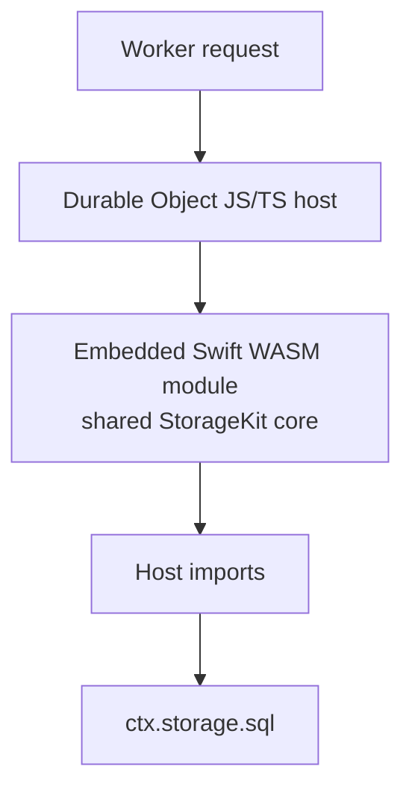

The Swift package owns the public StorageKit facade, shared Embedded mutation
semantics, binary wire validation, and WebAssembly ABI. The Cloudflare Worker
owns the Durable Object class, WASM lifecycle, memory bridge, and `ctx.storage.sql`
binding. The current host applies SQLite writes using wire-level mutation codes
and is protected by parity tests; it is not an app-level reimplementation of the
regular Swift facade.

## Storage Scope

`CloudflareDurableObjectStorageScope` is the stable identity for one logical
StorageKit database.

```swift
public struct CloudflareDurableObjectStorageScope: Sendable, Hashable, Codable {
    public let databaseID: String
    public let tenantID: String?
    public let workspaceID: String?
}
```

Rules:

- `databaseID` is required.
- `tenantID` and `workspaceID` are optional routing dimensions.
- The scope must produce a deterministic Durable Object name.
- The encoded name must be stable across deploys.
- Scope validation must reject blank values and unsafe delimiters.

## Routing Model

Routing is explicit and sits above the engine.

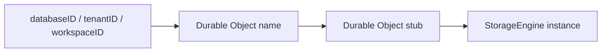

Recommended responsibilities:

| Type | Responsibility |
|---|---|
| `CloudflareDurableObjectStorageScope` | Logical database identity |
| `CloudflareDurableObjectStorageRouter` | Creates engines for scopes |
| `CloudflareDurableObjectStorageEngine` | StorageKit backend for one scope |
| `CloudflareDurableObjectStorageClient` | Regular Swift client abstraction for a scoped Durable Object endpoint |
| `CloudflareDurableObjectBinaryTransport` | Byte transport used by the regular Swift binary client |
| `CloudflareDurableObjectStorageHost` | Worker Durable Object class that owns SQLite and the WASM bridge |

The router is not transparent sharding. It chooses which single Durable Object
owns a logical database before any transaction starts.

## Partitioning and Sharding Design

In this backend, "sharding" means explicit Durable Object routing. It does not
mean FoundationDB-style automatic key-range distribution.

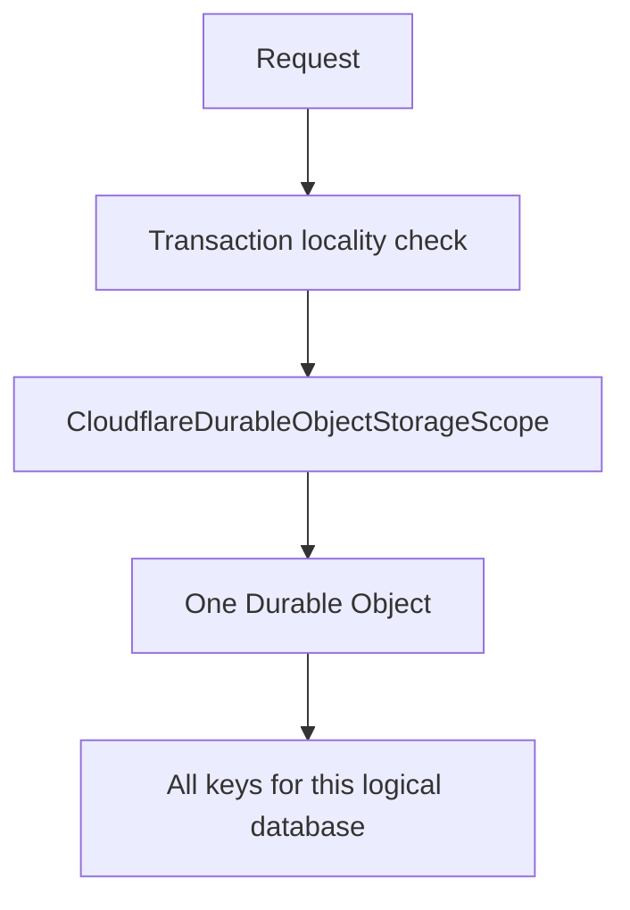

### Shard Unit

The shard unit must be selected by transaction locality. All data that can be
read or written in one StorageKit transaction must live in the same Durable
Object.

| Candidate shard unit | Decision | Reason |
|---|---|---|
| `databaseID` | Default | Matches one logical StorageKit database. |
| `tenantID` + `databaseID` | Recommended for SaaS isolation | Keeps tenant databases independent and movable. |
| `tenantID` + `workspaceID` + `databaseID` | Recommended for workspace-local products | Scales collaboration or document-like workloads. |
| entity type | Rejected | Index maintenance often touches item and index keys together. |
| index name | Rejected | Queries and writes need item and index consistency in one transaction. |
| key range | Rejected | Would require cross-object transaction semantics. |
| random bucket | Rejected | Destroys range scan locality and transaction guarantees. |

The default production scope should be:

```swift
CloudflareDurableObjectStorageScope(
    databaseID: databaseID,
    tenantID: tenantID,
    workspaceID: workspaceID
)
```

Use a narrower scope only when the product model guarantees that transactions
never need to cross that boundary.

### Scope to Durable Object Name

The Durable Object name must be deterministic and versioned.

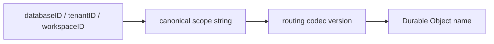

Requirements:

- The name codec must be versioned, starting with `v1`.
- The same scope must always resolve to the same Durable Object name.
- Different scopes must resolve to different names.
- The codec must reject blank scope components.
- The codec must preserve component boundaries. Concatenation without escaping is
  not allowed.
- Once released, the `v1` codec must remain supported.

Recommended canonical form:

```text
storage-kit/cfdo/v1/database/{databaseID}/tenant/{tenantID}/workspace/{workspaceID}
```

Optional components should use a reserved empty marker instead of being omitted,
so every name has the same structural shape.

```text
storage-kit/cfdo/v1/database/{databaseID}/tenant/_/workspace/_
```

If Cloudflare name length limits become a concern, the Worker host may
hash the canonical form. The hash input must be the canonical form, and the
routing metadata must keep the canonical scope for diagnostics.

### Metadata Guard

Each Durable Object should persist metadata for the scope it owns.

```sql
CREATE TABLE IF NOT EXISTS storagekit_metadata (
    key TEXT PRIMARY KEY,
    value TEXT NOT NULL
);
```

Required metadata:

| Key | Purpose |
|---|---|
| `routingCodecVersion` | Verifies the name codec version. |
| `databaseID` | Guards against accidental scope mismatch. |
| `tenantID` | Guards tenant routing when present. |
| `workspaceID` | Guards workspace routing when present. |
| `schemaVersion` | Tracks Durable Object storage schema version. |

On first use, the Durable Object records the metadata. On later use, it verifies
that the incoming scope matches the stored metadata. A mismatch must fail as
`StorageError.invalidOperation`.

### Cross-Scope Behavior

Cross-scope transactions are not supported.

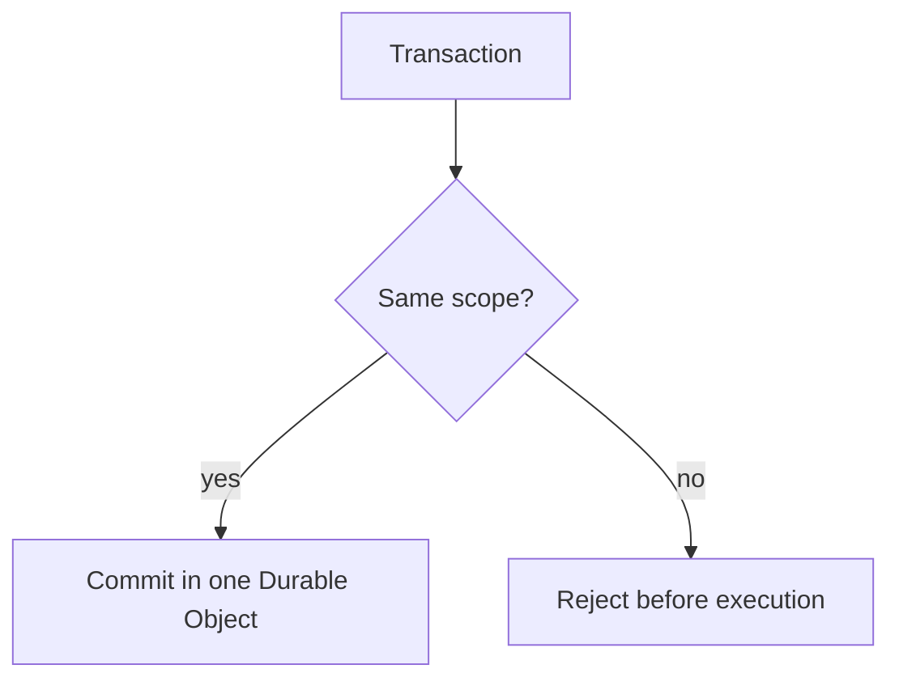

Rules:

- A `DBContainer` must be created for one
  `CloudflareDurableObjectStorageScope`.
- A `CloudflareDurableObjectStorageEngine` must not change scope after
  initialization.
- APIs that accept multiple scopes must reject mixed-scope transactions before
  creating a transaction.
- Cross-scope reads may be implemented by application-level fan-out, but they
  are outside StorageKit transaction semantics.
- Cross-scope writes must be modeled as application workflows with explicit
  compensation or migration steps.

### Resharding

Transparent resharding is out of scope. If a logical database becomes too large
or too hot for one Durable Object, the application must choose a new logical
scope boundary and migrate deliberately.

Supported production migration pattern:

1. Stop writes for the old scope or route them through an application-level
   migration gate.
2. Export ordered key-value rows from the old Durable Object.
3. Import rows into one or more new scopes.
4. Verify item count, range boundaries, and index consistency.
5. Switch routing metadata to the new scopes.
6. Keep the old scope read-only until rollback is no longer needed.

The backend must not silently split a single StorageKit database across multiple
Durable Objects.

## Completion Scope

This section defines what "complete" means for the routing and sharding design.
The value of this design comes from making logical database ownership explicit,
so the design is not complete until the routing contract is enforceable in code
and testable.

| Area | Included in this design | Completion requirement |
|---|---|---|
| Logical database boundary | Yes | One `CloudflareDurableObjectStorageScope` maps to one logical StorageKit database. |
| Scope fields | Yes | `databaseID` is required; `tenantID` and `workspaceID` are optional. |
| Scope validation | Yes | Validate non-empty UTF-8 components, reject control characters, and encode component boundaries. |
| Durable Object naming | Yes | Use a versioned deterministic codec and tests. |
| Routing layer | Yes | Provide a router/factory API that creates engines from scopes. |
| Engine boundary | Yes | One engine instance is immutable and bound to one scope. |
| Transaction boundary | Yes | A transaction cannot cross scopes or Durable Objects. |
| Metadata guard | Yes | Durable Object persists and validates scope metadata on every request family. |
| Transparent sharding | Explicitly excluded | Do not split one logical database across multiple Durable Objects. |
| Resharding | Manual only | Provide export/import/migration workflow documentation and tests for key ordering. |
| Worker protocol | Yes | Define request/response DTOs and protocol versioning. |
| Swift WebAssembly boundary | Yes | Swift/WASM owns storage semantics; Worker host provides `ctx.storage.sql` capabilities. |
| Testing | Yes | Add unit tests, fake-host backend tests, and local Worker integration tests. |
| Operations | Yes | Add readiness, metrics, limits, and diagnostic requirements. |

The current document includes the architectural boundary, routing contract,
component responsibilities, transaction model, request DTOs, and operational
acceptance criteria needed to begin implementation.

## Required Production Contract

The following contract must be implemented for the routing design to be
considered complete.

### Scope Contract

```swift
public struct CloudflareDurableObjectStorageScope: Sendable, Hashable, Codable {
    public let databaseID: String
    public let tenantID: String?
    public let workspaceID: String?

    public init(
        databaseID: String,
        tenantID: String? = nil,
        workspaceID: String? = nil
    ) throws
}
```

Requirements:

- Reject blank `databaseID`.
- Reject blank optional components when they are provided.
- Normalize scope components before encoding.
- Preserve case exactly unless a product-level rule states otherwise.
- Keep validation independent from Cloudflare transport details.
- Provide a stable `canonicalDescription` for diagnostics.

### Name Codec Contract

```swift
public protocol CloudflareDurableObjectNameCodec: Sendable {
    var version: String { get }

    func name(for scope: CloudflareDurableObjectStorageScope) throws -> String
}
```

Requirements:

- `version` starts at `v1`.
- `name(for:)` is deterministic.
- The codec preserves component boundaries.
- The codec has collision tests.
- The codec has round-trip diagnostics even if the final Durable Object name is
  hashed.
- Released codec versions remain readable.

### Router Contract

```swift
public protocol CloudflareDurableObjectStorageRouter: Sendable {
    func engine(
        for scope: CloudflareDurableObjectStorageScope
    ) async throws -> CloudflareDurableObjectStorageEngine
}
```

Requirements:

- The router is the only place that converts a scope into a Durable Object
  target.
- The router may cache engines by scope.
- Cached engines must not change scope.
- Routing failures must map to typed `StorageError` values.
- The router must expose diagnostics showing the scope and name codec version.

### Engine Contract

`CloudflareDurableObjectStorageEngine` is a `StorageEngine` for exactly one
scope.

Requirements:

- Configuration includes `scope`, `host`, `nameCodec`, and limit settings.
- `createTransaction()` creates a transaction bound to the same scope.
- `directoryService` uses deterministic static directory mapping.
- `shutdown()` is idempotent.
- `withAutoCommit` is allowed only for single-operation reads/probes or must
  delegate to the same one-scope transaction semantics.

### Durable Object Metadata Contract

Every request that can initialize or mutate storage must verify the scope
metadata.

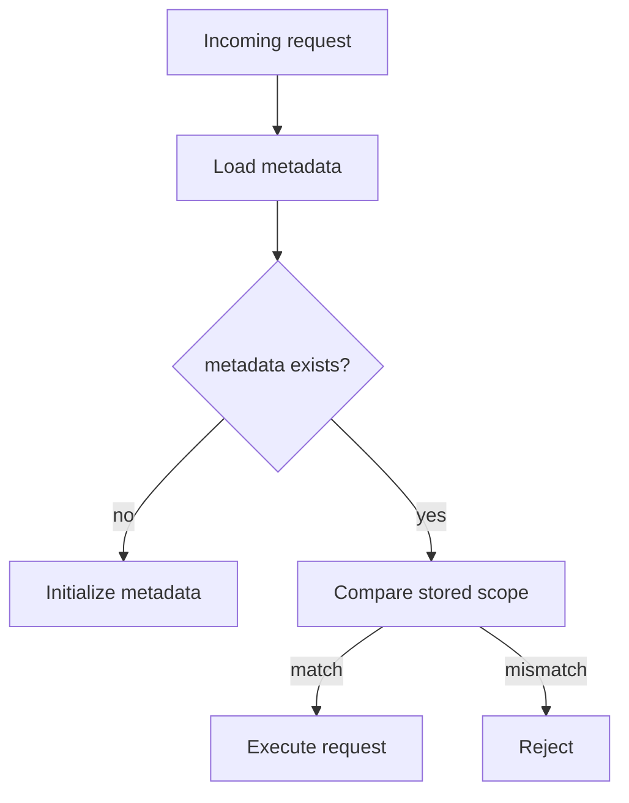

Requirements:

- First request initializes metadata in the same transaction as schema setup.
- Later requests reject mismatched `databaseID`, `tenantID`, or `workspaceID`.
- Metadata includes `routingCodecVersion` and storage `schemaVersion`.
- Mismatch errors must be deterministic and sanitized.

### Cross-Scope Contract

Cross-scope support is outside StorageKit transaction semantics.

Allowed:

- Independent read-only fan-out at the application layer.
- Explicit migration workflows.
- Explicit application-level compensation flows.

Rejected:

- A single `Transaction` touching multiple scopes.
- A single `DBContainer` changing scopes after initialization.
- Automatic key-range splitting behind one `StorageEngine`.

## Responsibility Separation

Cloudflare support is split by ownership of semantics and runtime APIs.

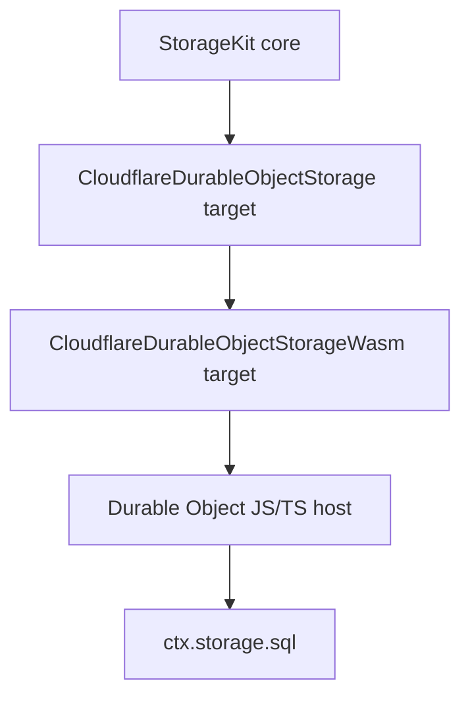

| Layer | Owns | Must not own |
|---|---|---|
| StorageKit core | `StorageEngine`, `Transaction`, `MutationType`, tuple/subspace utilities | Cloudflare names, Worker APIs, Durable Object routing |
| `CloudflareDurableObjectStorage` Swift target | Scope, name codec, router, engine, transaction buffering, DTOs, error mapping | `ctx.storage.sql`, JavaScript runtime APIs, Vapor |
| `StorageKitEmbeddedCore` Swift target | Shared Embedded-compatible StorageKit semantics and mutation semantics | Cloudflare routing, Durable Object host details |
| `CloudflareDurableObjectStorageEmbedded` Swift target | Cloudflare-specific Embedded runtime over `StorageKitEmbeddedCore` and a fixed binary wire codec | Foundation runtime assumptions, JavaScript runtime APIs |
| `CloudflareDurableObjectStorageWasm` Swift target | WebAssembly exports, fixed binary validation, Embedded Swift atomic mutation export | Durable Object class definition, Cloudflare binding lookup, SQLite schema |
| Durable Object JS/TS host | Durable Object class, WASM module lifecycle, memory bridge, SQLite persistence, keyset pagination, conflict log overlap checks | Public StorageKit API, Cloudflare scope routing decisions, atomic mutation semantics when WASM is available |
| Host SQL bindings | Synchronous SQLite persistence and conflict-log operations | StorageKit public API, app-level routing decisions |
| database-framework | Uses `StorageEngine` through `.custom(engine)` | Cloudflare runtime details |
| Application | Chooses `databaseID`, `tenantID`, and `workspaceID` | Hidden cross-scope transactions |

This separation keeps Cloudflare as an adapter target, not a new assumption in
the core storage abstraction.

## Swift Target Design

The Swift implementation should live in a new StorageKit product and target.
The Worker runtime entrypoint should be a separate WASM adapter target.

```text
Sources/CloudflareDurableObjectStorage/
  CloudflareDurableObjectStorageScope.swift
  CloudflareDurableObjectNameCodec.swift
  CloudflareDurableObjectStorageRouter.swift
  CloudflareDurableObjectStorageEngine.swift
  CloudflareDurableObjectStorageTransaction.swift
  CloudflareDurableObjectRangeResult.swift
  CloudflareDurableObjectStorageClient.swift
  CloudflareDurableObjectBinaryClient.swift
  CloudflareDurableObjectBinaryTransport.swift
  CloudflareDurableObjectHTTPTransport.swift
  CloudflareDurableObjectRequest.swift
  CloudflareDurableObjectResponse.swift
  CloudflareDurableObjectErrorMapper.swift
  CloudflareDurableObjectLimits.swift

Sources/StorageKitEmbeddedCore/
  EmbeddedBytes.swift
  EmbeddedMutationType.swift
  EmbeddedMutationApply.swift
  EmbeddedRangeOverlay.swift
  EmbeddedByteOrdering.swift

Sources/CloudflareDurableObjectStorageEmbedded/
  CloudflareDurableObjectEmbeddedScope.swift
  CloudflareDurableObjectEmbeddedBinaryCodec.swift
  CloudflareDurableObjectEmbeddedKernel.swift
  CloudflareDurableObjectEmbeddedMutation.swift
  CloudflareDurableObjectEmbeddedError.swift

Sources/CloudflareDurableObjectStorageWasm/
  CloudflareDurableObjectWasmExports.swift
  CloudflareDurableObjectHostImports.swift
  CloudflareDurableObjectWasmMemory.swift
  CloudflareDurableObjectWasmRequestDispatcher.swift

Workers/CloudflareDurableObjectStorageHost/
  src/CloudflareDurableObjectStorageHost.js
  src/StorageKitDurableObjectHost.js
  src/StorageKitSQLiteStore.js
  src/StorageKitWasmBridge.js
  src/StorageKitWireCodec.js
  test/StorageKitDurableObjectHost.test.js
  test/StorageKitWasmBridge.test.js
```

Package product:

```swift
.library(
    name: "CloudflareDurableObjectStorage",
    targets: ["CloudflareDurableObjectStorage"]
)
```

```swift
.executable(
    name: "CloudflareDurableObjectStorageWasm",
    targets: ["CloudflareDurableObjectStorageWasm"]
)
```

The storage target depends only on `StorageKit` and Foundation-level libraries
required for encoding. It should not depend on Vapor, JavaScriptKit, or a
specific Worker transport.

`StorageKitEmbeddedCore` and the Cloudflare Embedded target must be buildable
with the Embedded Swift Wasm SDK. They must not depend on Foundation runtime
assumptions, async runtime features, or protocol existential dispatch that
Embedded Swift rejects. They use a StorageKit-specific fixed binary wire codec
instead of `Codable`, WebActor, or Distributed Actor transport codecs.

The WASM target depends on `CloudflareDurableObjectStorageEmbedded`, which
depends on `StorageKitEmbeddedCore`. It contains only the exported ABI and host
import declarations needed by the Cloudflare Worker host.

## WASM-First Runtime Model

Cloudflare Durable Objects require a JavaScript module entrypoint, but the
storage implementation is delivered as Swift WebAssembly.

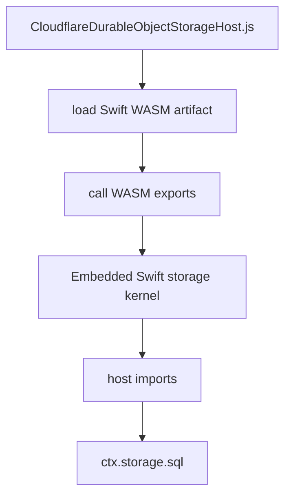

Responsibilities:

| Component | Responsibility |
|---|---|
| Embedded Swift WASM artifact | Fixed binary wire validation, StorageKit-compatible atomic mutation semantics, ABI boundary |
| JS/TS Durable Object host | Durable Object class, WASM loading, memory bridge, SQLite key/value persistence, range pagination, conflict-log overlap checks |
| `ctx.storage.sql` | Durable Object SQLite persistence only |

The JS/TS host is an adapter around Cloudflare runtime APIs and SQLite. It may
own SQL-specific persistence mechanics such as conflict-log overlap checks, but
it must not own StorageKit atomic mutation semantics when the WASM artifact is
available. The fallback JavaScript mutation implementation exists only for
diagnostics and no-WASM local testing.

## Strategic Goal Preservation

The Embedded/WASM design must not become a separate product that only resembles
StorageKit. The goal is to run the same database semantics on Cloudflare, with
the Worker artifact kept small enough for the runtime.

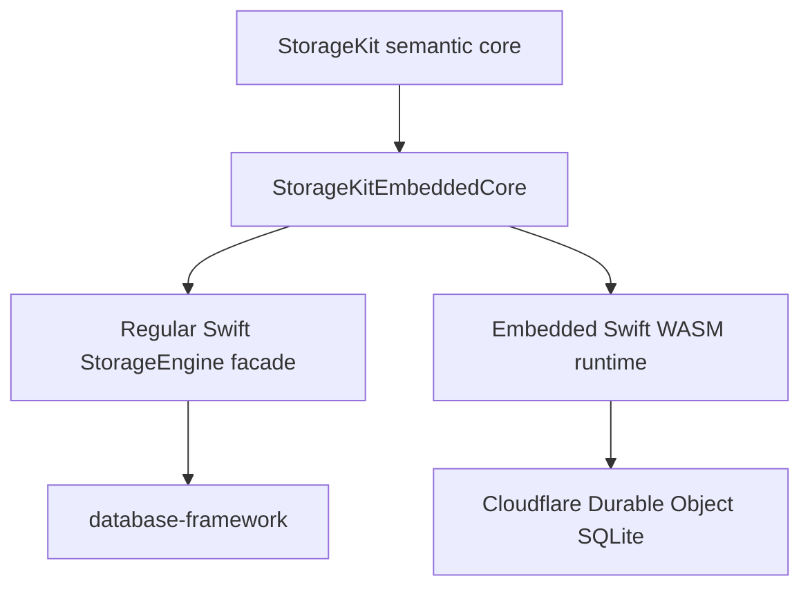

Design rule:

> If a behavior defines StorageKit correctness, it must live in shared Swift
> source or be generated from shared tests. It must not be hand-reimplemented in
> the JS/TS host and must not diverge between regular Swift and Embedded Swift.

What is staged, not abandoned:

| Layer | Cloudflare Worker/WASM position |
|---|---|
| StorageKit byte ordering, tuple-adjacent bytes, mutation semantics | Must be shared with regular StorageKit. |
| `StorageEngine` facade | May remain regular Swift only at first, wrapping the shared core in tests and non-WASM usage. |
| Cloudflare DO storage runtime | Embedded Swift/WASM runtime using shared core. |
| database-framework read/write path | Must remain a target for WASM compatibility audit and staged porting. |
| database-framework features with large dependencies | Audit and refactor until they can be lowered through the Swift/Wasm path. Containers are a separate deployment target, not the default fallback. |

This is not a decision that database-framework cannot run on Cloudflare Workers.
It is a decision that the first Worker artifact must extract and share the core
semantics instead of attempting a full-package compile before the dependency and
size audit is complete.

No-compromise rule:

> A Cloudflare runtime limitation is an implementation constraint to design
> around, not permission to reduce the product goal. If a Swift feature does not
> lower today, the design records the missing lowering, host import, ABI, or
> package split required to make it lower.

## SwiftWeb Alignment

The Cloudflare deployment model should align with SwiftWeb's host architecture:
Swift owns the app/runtime semantics, while generated JavaScript or TypeScript
owns Cloudflare entrypoints and bindings.

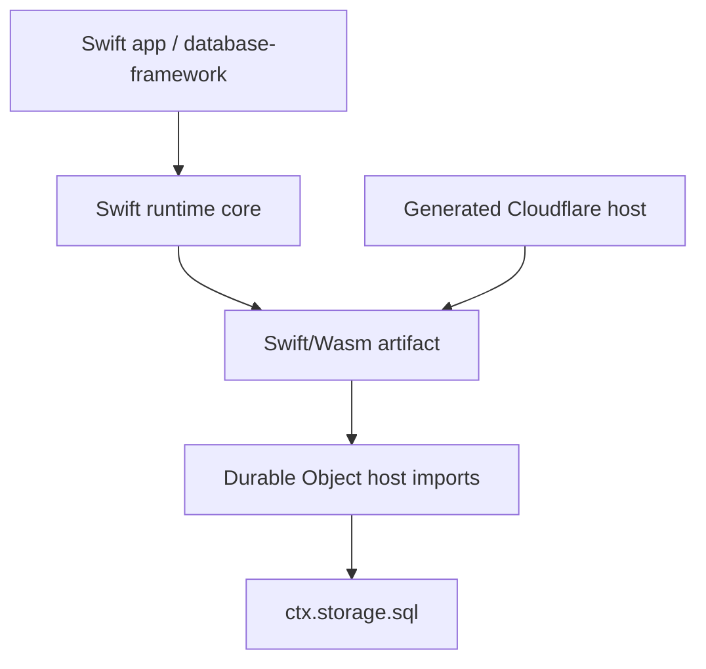

Alignment requirements:

| Area | Requirement |
|---|---|
| Host model | Follow SwiftWeb's generated Cloudflare host pattern. |
| Swift ownership | Database semantics remain in Swift, compiled to Wasm where deployed to Workers. |
| Host shell | JavaScript or TypeScript owns only fetch/Durable Object entrypoints, bindings, and memory bridge. |
| Tooling | Reuse or mirror SwiftWeb's WASM build, artifact processing, size reporting, and generated package layout. |
| Runtime profiles | Support standard and embedded profiles as build choices, not as product capability reductions. |
| Future database-framework lowering | Treat database-framework compatibility as a required staged port, not an optional stretch goal. |

SwiftWeb already separates the public app model from Vapor and Cloudflare host
adapters. Database must follow the same direction: host adapters lower Swift
semantics to Cloudflare, they do not replace those semantics.

Embedded Swift constraints:

- No Foundation dependency in the WASM artifact.
- WebActor and Distributed Actor typed RPC are not required for the initial
  Cloudflare storage runtime.
- The WASM artifact uses a fixed StorageKit binary wire codec instead of
  `Codable` or Foundation encoders.
- No reflection-dependent behavior.
- No dynamic plugin/registry loading.
- No Vapor, NIO, or EventLoop types.
- Prefer fixed-layout DTOs, enums with explicit wire tags, and StorageKit-owned
  binary codecs.
- Treat all host interaction as pointer/length buffers and integer status codes.
- Do not treat an initial Embedded compile failure as a design boundary. The
  compatibility audit must produce concrete refactors or host imports needed to
  lower the Swift API surface.

WASM artifact layout:

```text
Workers/CloudflareDurableObjectStorageHost/
  wasm/
    CloudflareDurableObjectStorageWasm.wasm
    CloudflareDurableObjectStorageWasm.imports.json
    CloudflareDurableObjectStorageWasm.exports.json
```

The `imports.json` and `exports.json` files document the ABI expected by the
Worker host. They are generated or validated during the WASM build pipeline.

Build contract:

```bash
swift build \
  --swift-sdk swift-6.3.1-RELEASE_wasm \
  --product CloudflareDurableObjectStorageWasm \
  -c release
```

Release builds must run size inspection after producing the `.wasm` artifact.
The exact initial size budget should be set after the first implementation
baseline, then treated as a regression guard.

## Directory and File Layout

The implementation is split into four physical areas:

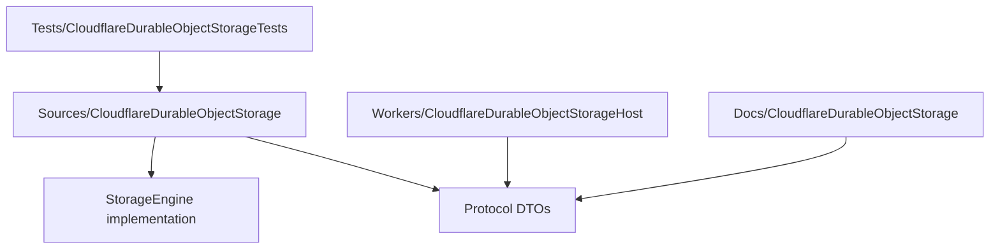

Top-level layout:

```text
storage-kit/
  Package.swift
  Sources/
    StorageKit/
    StorageKitEmbeddedCore/
    CloudflareDurableObjectStorage/
    CloudflareDurableObjectStorageEmbedded/
    CloudflareDurableObjectStorageWasm/
  Tests/
    CloudflareDurableObjectStorageTests/
    CloudflareDurableObjectStorageIntegrationTests/
    CloudflareDurableObjectStorageEmbeddedTests/
  Workers/
    CloudflareDurableObjectStorageHost/
  Docs/
    CloudflareDurableObjectStorage/
    CLOUDFLARE_DURABLE_OBJECT_STORAGE_DESIGN.md
```

### Package Layout

`Package.swift` should add one regular library product, one Embedded core
target, one Cloudflare Embedded target, one WASM executable, and test targets.

```swift
.library(
    name: "CloudflareDurableObjectStorage",
    targets: ["CloudflareDurableObjectStorage"]
)
```

```swift
.target(
    name: "CloudflareDurableObjectStorage",
    dependencies: ["StorageKit"]
)
```

```swift
.target(
    name: "StorageKitEmbeddedCore",
    dependencies: []
)
```

```swift
.target(
    name: "CloudflareDurableObjectStorageEmbedded",
    dependencies: [
        "StorageKitEmbeddedCore",
    ]
)
```

```swift
.executableTarget(
    name: "CloudflareDurableObjectStorageWasm",
    dependencies: ["CloudflareDurableObjectStorageEmbedded"]
)
```

```swift
.testTarget(
    name: "CloudflareDurableObjectStorageTests",
    dependencies: ["CloudflareDurableObjectStorage"]
)
```

```swift
.testTarget(
    name: "CloudflareDurableObjectStorageIntegrationTests",
    dependencies: ["CloudflareDurableObjectStorage"]
)
```

```swift
.testTarget(
    name: "CloudflareDurableObjectStorageEmbeddedTests",
    dependencies: ["CloudflareDurableObjectStorageEmbedded"]
)
```

The integration test target must skip cleanly unless the local Worker runtime is
available.

### Swift Source Layout

The Swift target uses one primary type per file.

```text
Sources/CloudflareDurableObjectStorage/
  Scope/
    CloudflareDurableObjectStorageScope.swift
    CloudflareDurableObjectScopeValidationError.swift
    CloudflareDurableObjectNameCodec.swift
    CloudflareDurableObjectV1NameCodec.swift
    CloudflareDurableObjectRoutedName.swift
  Routing/
    CloudflareDurableObjectStorageRouter.swift
    CloudflareDurableObjectStorageEngineFactory.swift
    CloudflareDurableObjectRoutingDiagnostics.swift
  Engine/
    CloudflareDurableObjectStorageConfiguration.swift
    CloudflareDurableObjectStorageEngine.swift
    CloudflareDurableObjectLimits.swift
    CloudflareDurableObjectReadinessReport.swift
  Transaction/
    CloudflareDurableObjectStorageTransaction.swift
    CloudflareDurableObjectWriteOp.swift
    CloudflareDurableObjectRangeResult.swift
    CloudflareDurableObjectRangePage.swift
    CloudflareDurableObjectTransactionState.swift
  Client/
    CloudflareDurableObjectStorageClient.swift
    CloudflareDurableObjectBinaryClient.swift
    CloudflareDurableObjectBinaryTransport.swift
    CloudflareDurableObjectHTTPTransport.swift
    CloudflareDurableObjectRequest.swift
    CloudflareDurableObjectResponse.swift
    CloudflareDurableObjectOperation.swift
    CloudflareDurableObjectBytes.swift
    CloudflareDurableObjectMutation.swift
    CloudflareDurableObjectMutationTypeCode.swift
    CloudflareDurableObjectErrorEnvelope.swift
    CloudflareDurableObjectProtocolVersion.swift
  Errors/
    CloudflareDurableObjectErrorMapper.swift
    CloudflareDurableObjectStorageClientError.swift
  Migration/
    CloudflareDurableObjectExportRequest.swift
    CloudflareDurableObjectExportResponse.swift
    CloudflareDurableObjectImportBatchRequest.swift
    CloudflareDurableObjectImportBatchResponse.swift
```

WASM adapter layout:

Embedded kernel layout:

```text
Sources/StorageKitEmbeddedCore/
  Bytes/
    EmbeddedBytes.swift
    EmbeddedByteOrdering.swift
  Mutation/
    EmbeddedMutationType.swift
    EmbeddedMutationApply.swift
    EmbeddedAtomicMutationResult.swift
  Range/
    EmbeddedRangeOverlay.swift
    EmbeddedKeyRange.swift
  Codec/
    EmbeddedBinaryReader.swift
    EmbeddedBinaryWriter.swift
    EmbeddedBase64URL.swift
    EmbeddedWireError.swift
  Limits/
    EmbeddedLimits.swift

Sources/CloudflareDurableObjectStorageEmbedded/
  ABIModel/
    CloudflareDurableObjectEmbeddedBytes.swift
    CloudflareDurableObjectEmbeddedRequest.swift
    CloudflareDurableObjectEmbeddedResponse.swift
    CloudflareDurableObjectEmbeddedOperation.swift
    CloudflareDurableObjectEmbeddedMutation.swift
    CloudflareDurableObjectEmbeddedStatusCode.swift
  Codec/
    CloudflareDurableObjectEmbeddedBinaryCodec.swift
    CloudflareDurableObjectEmbeddedJSONCodec.swift
    CloudflareDurableObjectEmbeddedNameCodec.swift
  Kernel/
    EmbeddedStorageKernel.swift
    EmbeddedTransactionKernel.swift
    EmbeddedRangeOverlay.swift
    EmbeddedConflictChecker.swift
    EmbeddedCommitExecutor.swift
  Host/
    EmbeddedHostABI.swift
    EmbeddedHostSQL.swift
    EmbeddedHostTransaction.swift
  Limits/
    EmbeddedLimits.swift
```

`StorageKitEmbeddedCore` is shared semantic code. The Cloudflare Embedded target
adds Cloudflare routing, metadata, host SQL calls, and wire dispatch around that
core. If the public `StorageEngine` protocol cannot compile under Embedded
Swift, the Embedded target may expose a smaller ABI, but it must still call the
shared semantic core.

```text
Sources/CloudflareDurableObjectStorageWasm/
  CloudflareDurableObjectStorageWasmEntrypoint.swift
  CloudflareDurableObjectHostImports.swift
  CloudflareDurableObjectWasmExports.swift
  CloudflareDurableObjectWasmMemory.swift
  CloudflareDurableObjectWasmRequestDispatcher.swift
```

Swift file responsibilities:

| Directory | Responsibility |
|---|---|
| `Scope/` | Scope validation, canonical diagnostics, Durable Object name codec |
| `Routing/` | Scope-to-engine factory, diagnostics, optional engine cache |
| `Engine/` | `StorageEngine` conformance and lifecycle |
| `Transaction/` | `Transaction` conformance, local write buffer, range overlay |
| `Protocol/` | Runtime-neutral JSON DTOs and wire enums |
| `Errors/` | Mapping host and platform failures into `StorageError` |
| `Migration/` | Ordered export/import DTOs for manual resharding |
| WASM `ABI/` | Exported functions called by the Durable Object host |
| WASM `Host/` | Imported host functions for SQL, clock, and logging |
| WASM `Memory/` | Pointer/length buffer ownership across the JS/WASM boundary |
| WASM `Runtime/` | Dispatch from encoded host request to Swift storage logic |
| EmbeddedCore `Mutation/` | Shared atomic mutation semantics used by regular and Embedded tests |
| EmbeddedCore `Range/` | Shared range overlay and byte ordering semantics |
| EmbeddedCore `Codec/` | Shared byte/base64 helpers that can compile under Embedded Swift |
| Embedded `ABIModel/` | Fixed-tag request and response models for Embedded Swift |
| Embedded `Codec/` | StorageKit fixed binary codec |
| Embedded `Kernel/` | Storage transaction semantics without Foundation |
| Embedded `Mutation/` | Atomic mutation semantics tested against `MutationType.apply` |
| Embedded `Host/` | Imported host SQL and transaction function declarations |

`CloudflareDurableObjectStorageEngine.swift` must not contain DTO definitions,
name encoding, host binding code, or mutation application code. Those stay in their
own files.

### Worker Host Layout

The Worker implementation is not the storage implementation. It is a runtime
host for the Swift WASM module and exposes `ctx.storage.sql` through narrow host
imports.

```text
Workers/CloudflareDurableObjectStorageHost/
  .gitignore
  package-lock.json
  package.json
  wrangler.jsonc
  scripts/
    prepare-wasm.mjs
  src/
    CloudflareDurableObjectStorageHost.js
    CloudflareDurableObjectStorageWorker.js
    StorageKitDurableObjectHost.js
    StorageKitSQLiteStore.js
    StorageKitWasmBridge.js
    StorageKitWireCodec.js
    StorageKitWireConstants.js
    StorageKitWireError.js
    StorageKitBinaryReader.js
    StorageKitBinaryWriter.js
    StorageKitMutation.js
    StorageKitScope.js
    StorageKitBase64URL.js
    StorageKitByteOrdering.js
  test/
    CloudflareDurableObjectStorageHost.test.js
    StorageKitDurableObjectHost.test.js
    StorageKitWasmBridge.test.js
    NodeSqlStorage.js
```

Worker host file responsibilities:

| Directory | Responsibility |
|---|---|
| `CloudflareDurableObjectStorageWorker.js` | Wrangler entrypoint that imports the generated WASM artifact |
| `CloudflareDurableObjectStorageHost.js` | Durable Object class and top-level scope router |
| `StorageKitDurableObjectHost.js` | Binary request dispatcher and typed error envelope mapper |
| `StorageKitSQLiteStore.js` | Bounded SQLite operations backed by `ctx.storage.sql` |
| `StorageKitWasmBridge.js` | WASM memory/export bridge |
| `StorageKitWire*` | JavaScript parity implementation of the fixed binary wire protocol |

`CloudflareDurableObjectStorageHost.js` stays thin: it routes by
`databaseID / tenantID / workspaceID`, dispatches binary messages, and provides
the WASM bridge. `StorageKitSQLiteStore.js` owns SQLite persistence, keyset
pagination, and conflict-log overlap checks. Atomic mutation semantics are
delegated to the Embedded Swift WASM export when the WASM artifact is loaded;
the JavaScript implementation is a local fallback and parity test oracle.

### Protocol Schema Layout

The JSON protocol is shared by Swift tests and Worker tests.

```text
Docs/CloudflareDurableObjectStorage/
  protocol-v1.schema.json
  protocol-v1.md
  worker-deployment.md
  wasm-boundary.md
  migration.md
```

`protocol-v1.schema.json` is the compatibility contract. The Swift DTO tests and
Worker protocol tests should both load the schema or equivalent fixtures.

### Swift Test Layout

```text
Tests/CloudflareDurableObjectStorageTests/
  Scope/
    CloudflareDurableObjectStorageScopeTests.swift
    CloudflareDurableObjectV1NameCodecTests.swift
  Routing/
    CloudflareDurableObjectStorageRouterTests.swift
  Protocol/
    CloudflareDurableObjectDTOEncodingTests.swift
    CloudflareDurableObjectMutationTypeCodeTests.swift
  Engine/
    CloudflareDurableObjectStorageEngineTests.swift
    CloudflareDurableObjectReadinessTests.swift
  Transaction/
    CloudflareDurableObjectTransactionCommitTests.swift
    CloudflareDurableObjectReadYourWritesTests.swift
    CloudflareDurableObjectRangeOverlayTests.swift
    CloudflareDurableObjectConflictTests.swift
    CloudflareDurableObjectAtomicMutationTests.swift
  Migration/
    CloudflareDurableObjectExportImportTests.swift
  Errors/
    CloudflareDurableObjectErrorMapperTests.swift
  Fakes/
    FakeDurableObjectHost.swift
    FakeDurableObjectStore.swift
    FakeDurableObjectConflictInjector.swift
  Fixtures/
    CloudflareDurableObjectScopeFixtures.swift
    CloudflareDurableObjectProtocolFixtures.swift
```

### Swift Integration Test Layout

```text
Tests/CloudflareDurableObjectStorageIntegrationTests/
  CloudflareDurableObjectIntegrationTestHelper.swift
  WorkerRuntimeAvailabilityTests.swift
  WorkerProtocolCompatibilityTests.swift
  WorkerTransactionSemanticsTests.swift
  WorkerMigrationTests.swift
```

Integration tests must be disabled unless an explicit environment variable is
set and the Worker runtime is reachable. Missing runtime support should produce
a clean skip, not a failure.

Embedded tests:

```text
Tests/CloudflareDurableObjectStorageEmbeddedTests/
  EmbeddedBinaryCodecTests.swift
  EmbeddedWireProtocolRoundTripTests.swift
  EmbeddedCoreParityTests.swift
  EmbeddedDTOWireParityTests.swift
  EmbeddedMutationParityTests.swift
  EmbeddedRangeOverlayTests.swift
  EmbeddedConflictCheckerTests.swift
  EmbeddedABISurfaceTests.swift
  EmbeddedWasmSizeBudgetTests.swift
```

Embedded tests must prove that the fixed binary protocol preserves the same
semantic DTO surface as regular Swift diagnostic DTOs. `EmbeddedCoreParityTests`
verify that regular Swift and Embedded-compatible paths exercise the same
semantic core.
`EmbeddedMutationParityTests` compare Embedded mutation results against regular
`MutationType.apply` outside the WASM artifact.

### File Ownership Rules

| Rule | Applies to |
|---|---|
| Core `StorageKit` files remain Cloudflare-free | `Sources/StorageKit/**` |
| Regular Swift client DTOs live in the facade target | `Sources/CloudflareDurableObjectStorage/**` |
| Embedded wire DTOs live in the embedded target | `Sources/CloudflareDurableObjectStorageEmbedded/**` |
| Worker-only SQL execution lives in the host adapter | `Workers/CloudflareDurableObjectStorageHost/src/StorageKitSQLiteStore.js` |
| Scope/name routing stays outside transaction implementation | `CloudflareDurableObjectStorageScope.swift`, `CloudflareDurableObjectStorageRouter.swift`, `StorageKitScope.js` |
| Test fakes do not ship in library target | `Tests/**` |

## Scope Validation and Name Codec

Scope components are opaque identifiers, not display names.

Validation:

- `databaseID` must be non-empty after trimming ASCII whitespace.
- `tenantID` and `workspaceID` may be `nil`; provided values must be non-empty
  after trimming ASCII whitespace.
- Components must not contain ASCII control characters.
- Components are encoded as UTF-8 bytes.
- Case is preserved exactly.
- No product-specific lowercasing or slug rules are applied in StorageKit.

`v1` name encoding:

```text
storage-kit/cfdo/v1/database/{base64url(databaseID)}/tenant/{tenantPart}/workspace/{workspacePart}
```

Where:

- `tenantPart` is `base64url(tenantID)` or `_`.
- `workspacePart` is `base64url(workspaceID)` or `_`.
- Base64url uses no padding.
- Component boundaries are fixed by the path labels.
- The configured name byte limit is validated before routing.

Diagnostics must retain the decoded scope and codec version even when only the
encoded Durable Object name is sent to the Worker.

## Request and Response DTOs

DTOs have two representations:

| Representation | Used by | Encoding |
|---|---|---|
| Regular Swift DTO | Native tests, diagnostics, non-WASM adapters | `Codable` JSON |
| Embedded DTO | Swift WASM artifact and Worker host | fixed StorageKit binary codec |

The semantic fields and coding shape must be aligned. The regular target uses
Swift `Codable` for diagnostics. The Embedded target uses explicit encode/decode
functions over a stable binary wire format. Binary fields in JSON diagnostics
use base64url strings without padding. Binary fields in the Embedded binary
codec use length-prefixed bytes.

```swift
public struct CloudflareDurableObjectBytes: Sendable, Codable, Hashable {
    public let base64url: String
}

public struct CloudflareDurableObjectRequest: Sendable, Codable {
    public let protocolVersion: String
    public let requestID: String
    public let scope: CloudflareDurableObjectStorageScope
    public let operation: CloudflareDurableObjectOperation
}

public enum CloudflareDurableObjectOperation: Sendable, Codable {
    case readiness
    case read(ReadRequest)
    case range(RangeRequest)
    case commit(CommitRequest)
    case export(ExportRequest)
    case importBatch(ImportBatchRequest)
}
```

Operation payloads:

| Operation | Payload | Response |
|---|---|---|
| `readiness` | scope only | schema version, commit version, metadata status |
| `read` | key, snapshot flag, optional expected read version | value, key version, current commit version |
| `range` | begin, end, limit, reverse, snapshot flag, optional expected read version | rows, next cursor, current commit version |
| `commit` | observed read version, read-conflict mode, ordered mutations | committed version |
| `export` | cursor, limit | ordered rows, next cursor, commit version |
| `importBatch` | expected empty or migration token, ordered rows | imported count |

Mutation payloads:

```swift
public enum CloudflareDurableObjectMutationTypeCode: String, Sendable, Codable {
    case add
    case bitOr
    case bitAnd
    case bitXor
    case max
    case min
    case compareAndClear
    case setVersionstampedKey
    case setVersionstampedValue
}

public enum CloudflareDurableObjectMutation: Sendable, Codable {
    case set(key: CloudflareDurableObjectBytes, value: CloudflareDurableObjectBytes)
    case clear(key: CloudflareDurableObjectBytes)
    case clearRange(begin: CloudflareDurableObjectBytes, end: CloudflareDurableObjectBytes)
    case atomic(
        key: CloudflareDurableObjectBytes,
        param: CloudflareDurableObjectBytes,
        mutationType: CloudflareDurableObjectMutationTypeCode
    )
}
```

DTO rules:

- Every request includes the full scope.
- StorageKit runtime types are converted to wire DTO types at the adapter
  boundary.
- Regular Swift DTOs conform to `Codable`.
- Embedded DTOs use explicit encode/decode functions over the StorageKit binary
  wire codec.
- DTO field names, operation cases, and mutation cases must stay semantically
  aligned between regular Swift diagnostics and the Embedded wire protocol.
- Every mutating request verifies metadata before mutation.
- Every response includes a sanitized error envelope on failure.
- Unknown protocol versions are rejected.
- Unknown enum cases are rejected instead of ignored.

Embedded binary codec rules:

- All multi-byte integers are little-endian.
- Every message starts with protocol version, operation tag, and request ID.
- Every byte array is encoded as `UInt32 byteCount` followed by raw bytes.
- Optional strings are encoded as a one-byte presence tag followed by UTF-8
  bytes when present.
- Unknown operation and mutation tags fail with an explicit status code.
- The host owns the SQLite adapter surface and delegates StorageKit atomic
  mutation semantics to the WASM export when a WASM artifact is loaded.
- The binary codec is the default Worker runtime codec.
- The JSON codec is available for diagnostics and protocol compatibility tests.

## Transaction Model

The v1 transaction model prioritizes correctness over concurrency. A remote
transaction handle is not kept open inside the Durable Object.

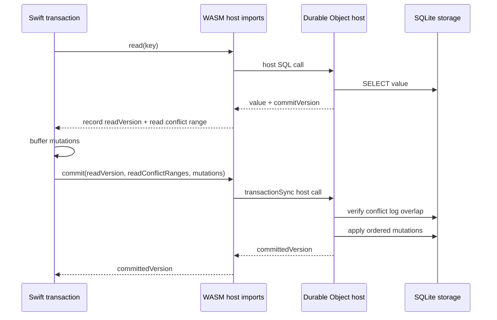

Rules:

- The Swift transaction records the first non-snapshot read version.
- Subsequent non-snapshot reads must observe the same commit version; otherwise
  the transaction fails with a retryable conflict.
- Snapshot reads do not create read conflicts.
- If a transaction has read conflicts, commit succeeds only when no write
  conflict range with a newer committed version overlaps the recorded read
  conflict ranges.
- Write-only transactions can commit against the current version.
- Atomic mutations are applied inside the Durable Object commit path using the
  same semantics as `MutationType.apply(to:param:)`. In Worker/WASM mode that
  logic is delegated to the Embedded Swift WASM export.

The transaction runner in database-framework can retry conflicts using the same
high-level policy as other StorageKit backends.

## Read-Your-Writes and Range Overlay

`CloudflareDurableObjectStorageTransaction` owns the local write buffer.

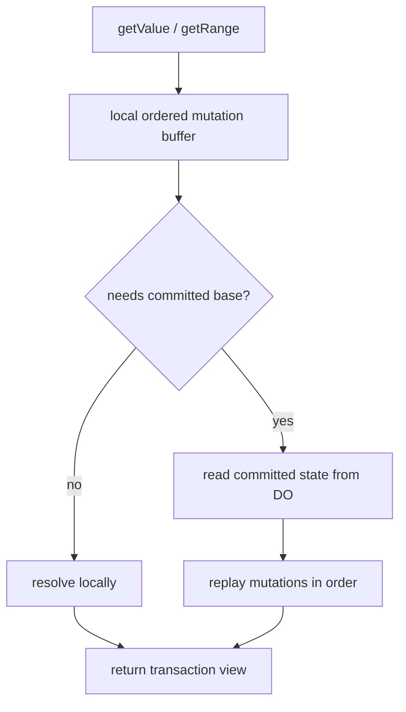

Point reads:

- Scan the local buffer from oldest to newest.
- Fetch the committed base value only when the buffered state requires it.
- Replay `set`, `clear`, `clearRange`, and `atomic` in order.

Range reads:

- Fetch committed rows from the Durable Object using keyset pagination.
- Collect buffered keys and range clears that intersect the requested range.
- Fetch base values for buffered atomic keys in the range when needed.
- Merge committed rows with buffered mutations by byte ordering.
- Apply `limit` and `reverse` after the transaction view is constructed.

This keeps `getRange` lazy at the remote page level while preserving
read-your-writes within the page being returned.

## WASM Executor and Durable Object Host Design

Swift/WASM owns the fixed binary kernel and ABI boundary. The Durable Object
host owns the runtime object and SQLite execution.

```text
Swift WASM:
  CloudflareDurableObjectStorageWasmEntrypoint
  CloudflareDurableObjectWasmRequestDispatcher
  CloudflareDurableObjectWasmMutationApplier
  CloudflareDurableObjectWasmExports
  CloudflareDurableObjectWasmMemory

Durable Object host:
  CloudflareDurableObjectStorageHost.js
  CloudflareDurableObjectStorageWorker.js
  StorageKitDurableObjectHost.js
  StorageKitSQLiteStore.js
  StorageKitWasmBridge.js
```

SQLite schema:

```sql
CREATE TABLE IF NOT EXISTS storagekit_kv (
    key BLOB PRIMARY KEY,
    value BLOB NOT NULL
);

CREATE TABLE IF NOT EXISTS storagekit_metadata (
    key TEXT PRIMARY KEY,
    value TEXT NOT NULL
);

CREATE TABLE IF NOT EXISTS storagekit_conflicts (
    version_hi INTEGER NOT NULL,
    version_lo INTEGER NOT NULL,
    begin_key BLOB NOT NULL,
    end_key BLOB NOT NULL
);
```

Required metadata:

| Key | Value |
|---|---|
| `routingCodecVersion` | Name codec version |
| `protocolVersion` | DTO protocol version |
| `databaseID` | Scope database ID |
| `tenantID` | Scope tenant ID or empty marker |
| `workspaceID` | Scope workspace ID or empty marker |
| `schemaVersion` | SQLite schema version |
| `commitVersion` | Monotonic logical commit version |

Commit flow:

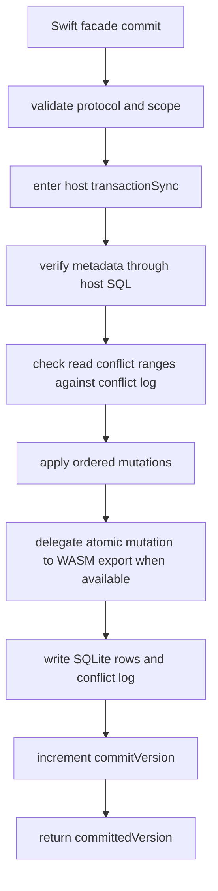

The host must run commit in the Durable Object storage transaction API. The
Swift facade must not rely on multi-request remote transaction handles. The
host owns SQL-specific conflict-log checks; `MutationType.apply` semantics
belong to Swift/WASM when the artifact is available.

## Limits and Operational Contract

Limits are configured instead of hard-coded so tests and deployments can mirror
Cloudflare's current platform limits.

```swift
public struct CloudflareDurableObjectLimits: Sendable, Hashable {
    public let maxKeyBytes: Int
    public let maxValueBytes: Int
    public let maxMutationsPerCommit: Int
    public let maxRangeLimit: Int
    public let maxNameBytes: Int
}
```

Operational requirements:

- `readiness` verifies schema, metadata, commit version, and a small SQL probe.
- Diagnostics include scope, codec version, protocol version, schema version,
  commit version, and runtime kind.
- Oversized keys, values, names, and batches fail before host commit.
- Range responses are bounded and paginated.
- Error messages are sanitized before crossing from Worker to Swift.

## Acceptance Criteria

The design is ready for implementation only when these checks are true.

| Check | Required evidence |
|---|---|
| Scope identity | Unit tests for validation, equality, hashing, diagnostics. |
| Name routing | Deterministic codec tests and collision-focused cases. |
| Scope isolation | Two scopes with same keys cannot observe each other. |
| Metadata guard | Mismatched request metadata is rejected before mutation. |
| Transaction locality | Cross-scope transaction attempts fail before host commit. |
| Key locality | Item keys and index keys for one logical database remain in one Durable Object. |
| Migration path | Export/import preserves byte ordering and count. |
| Failure mode | Router/host/DO failures map to typed `StorageError`. |
| Observability | Readiness and diagnostics expose scope, codec version, schema version, and storage availability. |
| Embedded compatibility | Embedded target builds without Foundation runtime assumptions. |
| Wire DTO parity | Regular diagnostic DTOs and Embedded binary DTOs round-trip the same semantic messages. |
| Shared semantics | Embedded and regular Swift paths use shared core or parity tests generated from the same fixtures. |
| WASM size | Release WASM artifact stays under the configured size budget. |
| ABI stability | Imports and exports match the checked-in ABI manifest. |

## Transaction Boundary

One `CloudflareDurableObjectStorageEngine` maps to one Durable Object. Therefore
one `Transaction` maps to one Durable Object transaction batch.

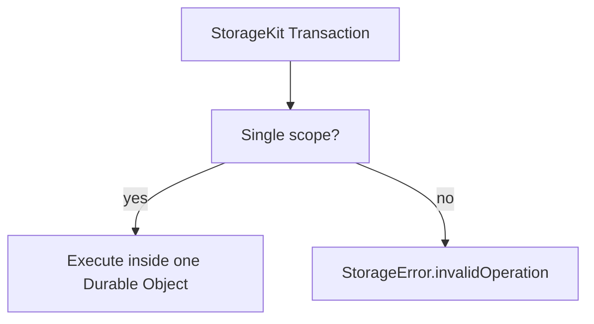

Required behavior:

- Reads and writes in a transaction must use one scope.
- Buffered writes must be replayed in order at commit.
- `getValue` must observe prior buffered writes and atomic mutations.
- `getRange` must either flush before the scan or merge buffered writes with
  scanned rows exactly.
- `atomicOp` must route through `MutationType.apply(to:param:)`.
- Versionstamp mutations must fail with the same typed error contract as other
  non-FoundationDB backends.

## Durable Object SQLite Layout

The Durable Object stores bytes as an ordered key-value table.

```sql
CREATE TABLE IF NOT EXISTS storagekit_kv (
    key BLOB PRIMARY KEY,
    value BLOB NOT NULL
);

CREATE TABLE IF NOT EXISTS storagekit_metadata (
    key TEXT PRIMARY KEY,
    value TEXT NOT NULL
);

CREATE TABLE IF NOT EXISTS storagekit_conflicts (
    version_hi INTEGER NOT NULL,
    version_lo INTEGER NOT NULL,
    begin_key BLOB NOT NULL,
    end_key BLOB NOT NULL
);
```

Required queries:

| StorageKit operation | Durable Object operation |
|---|---|
| `getValue` | `SELECT value, version FROM kv WHERE key = ?` |
| `setValue` | `INSERT ... ON CONFLICT(key) DO UPDATE`, setting the new commit version |
| `clear` | `DELETE FROM kv WHERE key = ?` |
| `clearRange` | `DELETE FROM kv WHERE key >= ? AND key < ?` |
| `getRange` | `SELECT key, value, version FROM kv WHERE key >= ? AND key < ? ORDER BY key LIMIT ?` |
| reverse range | `ORDER BY key DESC LIMIT ?` |
| `atomicOp` | read-modify-write using `MutationType.apply` semantics |

The implementation must verify Cloudflare's BLOB ordering behavior against
StorageKit byte ordering before enabling production use.

## Runtime Boundary

Swift/WASM should not depend directly on Workers runtime APIs. It should depend
on narrow host imports provided by the Durable Object host.

The regular Swift target uses a client protocol. The name intentionally says
`Client`, not `Host`, because this side consumes a remote scoped Durable Object
endpoint.

```swift
public protocol CloudflareDurableObjectStorageClient: Sendable {
    func read(_ request: CloudflareDurableObjectReadRequest) async throws
        -> CloudflareDurableObjectReadResponse

    func range(_ request: CloudflareDurableObjectRangeRequest) async throws
        -> CloudflareDurableObjectRangeResponse

    func commit(_ request: CloudflareDurableObjectCommitRequest) async throws
        -> CloudflareDurableObjectCommitResponse

    func readiness(_ request: CloudflareDurableObjectReadinessRequest) async throws
        -> CloudflareDurableObjectReadinessResponse
}
```

The Embedded/WASM target exposes and imports C ABI style functions instead of
using Swift protocols across the boundary.

```swift
@_cdecl("cfdo_handle_request")
public func cfdo_handle_request(
    _ requestPointer: UnsafePointer<UInt8>,
    _ requestLength: Int32
) -> Int32
```

Host imports are modeled as fixed function declarations in the Embedded target.
They accept pointer/length buffers and return integer status codes plus output
buffer handles. No Swift protocol or existential crosses the JS/WASM boundary.

Initial v1 request families:

| Request | Purpose |
|---|---|
| `read` | Point read |
| `range` | Bounded range read |
| `commit` | Apply a transaction batch atomically |
| `readiness` | Verify schema and storage availability |
| `export` | Export ordered rows for manual migration |
| `importBatch` | Import ordered rows for manual migration |

The v1 WASM host protocol uses stateless transaction batches:

1. Swift transaction buffers writes locally.
2. Swift reads committed state through the Durable Object binary endpoint and
   overlays local buffered state.
3. Swift commit sends observed read version, read conflict ranges, and the
   ordered mutation batch.
4. The host enters the Durable Object storage transaction, checks conflict-log
   overlap, applies ordered writes, and delegates atomic mutation semantics to
   Swift/WASM when available.

This avoids remote transaction handles and is easier to make retry-safe.
`begin` and `rollback` are reserved for a future stateful host protocol, but are not
part of v1.

## WebAssembly Boundary

Swift WebAssembly can host pure StorageKit and database-framework logic, but the
Durable Object storage API remains a Workers runtime API. The Durable Object
class and SQL host bindings stay in JavaScript or TypeScript.

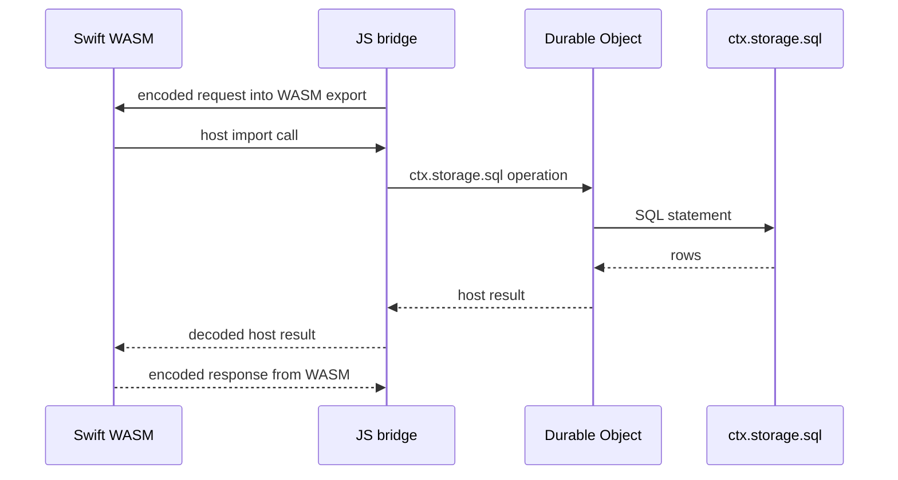

The backend design must work whether Swift runs in a Cloudflare Container or as
WebAssembly inside Workers.

## Error Semantics

Cloudflare-specific failures must be mapped into `StorageError`.

| Failure | StorageError |
|---|---|
| Durable Object unavailable | `.connectionFailure` |
| Commit result unknown | `.commitUnknownResult` |
| Cross-scope operation | `.invalidOperation` |
| Unsupported selector | `.invalidOperation` |
| Value/key over Cloudflare limit | `.backendError` with sanitized message |
| SQL constraint or storage failure | `.backendError` with sanitized message |
| Cancellation | Preserve `CancellationError` |

Errors must not leak raw platform messages when they may include deployment or
request internals.

## Testing Requirements

| Test area | Required coverage |
|---|---|
| Routing | deterministic name, scope isolation, validation failures |
| Transactions | commit, cancel, read-your-writes, rollback on operation failure |
| Ranges | forward, reverse, limit, empty ranges, boundary selectors |
| Atomic mutations | add, bit operations, max, min, compareAndClear, versionstamp failure |
| Batch commit | ordered replay, deduplication, clear after set, set after clear |
| Error mapping | unavailable object, unknown commit, invalid request, oversized key/value |
| Integration | common StorageKit behavior tests against a local Worker/DO test harness |

The first test layer uses an in-process fake
`CloudflareDurableObjectStorageClient`. The Worker package also runs Node host
tests, a WASM bridge test, `wrangler deploy --dry-run`, and a local
`wrangler dev` binary request smoke test via `npm run smoke:e2e`.

The local smoke test must cover multiple query shapes, not only one happy-path
range. Required query smoke coverage includes all key selector kinds, empty
results, unbounded lower and upper resolution, reverse cursor pagination,
snapshot range reads, stale non-snapshot range rejection, and bytewise
lexicographic prefix ranges.

Cloudflare edge validation uses the same binary smoke suite against a deployed
Worker endpoint:

```bash
STORAGEKIT_SMOKE_ENDPOINT=https://<worker-host> npm run smoke:remote
```

Persistence validation uses a stable scope so data can be written before a
redeploy and read after the redeploy:

```bash
STORAGEKIT_SMOKE_ENDPOINT=https://<worker-host> \
STORAGEKIT_PERSISTENCE_RUN_ID=release-candidate \
npm run smoke:remote:persistence

STORAGEKIT_SMOKE_ENDPOINT=https://<worker-host> \
STORAGEKIT_PERSISTENCE_MODE=read \
STORAGEKIT_PERSISTENCE_RUN_ID=release-candidate \
STORAGEKIT_PERSISTENCE_TOKEN=<token> \
npm run smoke:remote:persistence
```

## Detailed Test Design

```text
Tests/CloudflareDurableObjectStorageTests/
  ScopeTests.swift
  NameCodecTests.swift
  RouterTests.swift
  FakeDurableObjectHost.swift
  TransactionReadYourWritesTests.swift
  TransactionConflictTests.swift
  RangeOverlayTests.swift
  AtomicMutationTests.swift
  ErrorMappingTests.swift
  MigrationExportImportTests.swift
```

Test tiers:

| Tier | Runs against | Purpose |
|---|---|---|
| Unit | Pure Swift | Scope validation, name codec, DTO encoding, error mapping |
| Fake host | In-process fake Durable Object host | StorageKit semantics without Cloudflare runtime |
| Worker local | Local Cloudflare Worker runtime | WASM host bindings, metadata guard, DTO compatibility |
| End-to-end | Worker + Swift WASM | Full transaction semantics and migration workflow |

Required shared fixtures:

- Common StorageKit behavior suite adapted to `CloudflareDurableObjectStorage`.
- Deterministic scope generator using `databaseID`, `tenantID`, and
  `workspaceID`.
- Conflict fixture that changes commit version between read and commit.
- Range fixture with overlapping set, clear, clearRange, and atomic operations.

## References

- Cloudflare SQLite-backed Durable Object Storage:
  https://developers.cloudflare.com/durable-objects/api/sqlite-storage-api/
- Cloudflare Durable Objects best practices:
  https://developers.cloudflare.com/durable-objects/best-practices/rules-of-durable-objects/
- Cloudflare Workers WebAssembly:
  https://developers.cloudflare.com/workers/runtime-apis/webassembly/
- Embedded Swift:
  https://docs.swift.org/embedded/documentation/embedded/

## Implementation Phases

1. Add the design document and module contract.
2. Extract `StorageKitEmbeddedCore` from existing StorageKit semantics and add
   parity tests.
3. Add the fixed Embedded binary wire codec required by StorageKit and Cloudflare.
4. Add `CloudflareDurableObjectStorageScope` and routing tests.
5. Add regular diagnostic DTOs, Embedded binary DTOs, and WASM host protocol.
6. Add fake host and backend unit tests.
7. Implement `CloudflareDurableObjectStorageEngine` and transaction buffering
   against the shared semantic core.
8. Implement the Embedded Swift WASM artifact, JS/TS Durable Object host adapter,
   and WASM host imports.
9. Add integration tests using the Cloudflare local runtime.
10. Document deployment patterns for Workers, WebAssembly, and Containers.

## Design Decision

Cloudflare Durable Objects are valuable here as explicitly routed logical
databases, not as a transparent replacement for FoundationDB's distributed
cluster. The production requirement should therefore include both:

- `CloudflareDurableObjectStorageEngine`
- Explicit routing by `databaseID`, with optional `tenantID` and `workspaceID`

The requirement should not include transparent sharding or cross-object
transactions.
