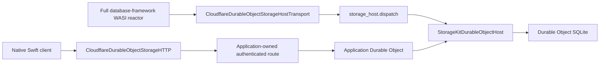
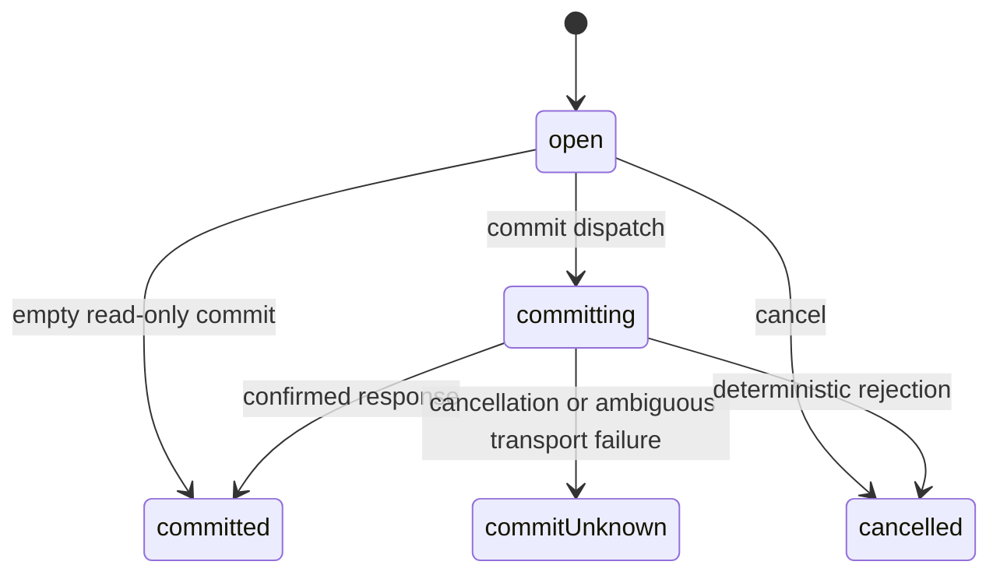
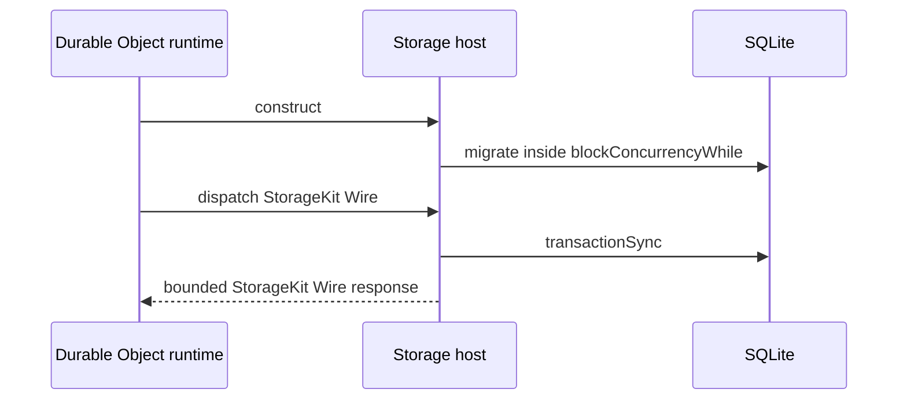

# Cloudflare Durable Object Storage Design

## Status

This document defines the first production contract for StorageKit on Cloudflare
Durable Objects.

- The canonical protocol is `StorageKit Wire v1`.
- There is no compatibility or version-negotiation path.
- The Durable Object SQLite implementation is the Cloudflare storage adapter.
- The application owns Durable Object routing and lifecycle.
- The reusable TypeScript host owns bounded StorageKit Wire dispatch and SQLite
  host operations.
- Database query, graph, schema, index, and transaction policy remain in Swift.

## Architectural Boundary


```mermaid
flowchart LR
    Native["Native Swift client"] --> HTTP["CloudflareDurableObjectStorageHTTP"]
    HTTP --> Router["Application-owned authenticated route"]
    Router --> DO["Application Durable Object"]

    Reactor["Full database-framework WASI reactor"] --> HostTransport["CloudflareDurableObjectStorageHostTransport"]
    HostTransport --> Import["storage_host.dispatch"]
    Import --> Store["StorageKitDurableObjectHost"]

    DO --> Store
    Store --> SQLite["Durable Object SQLite"]
```

Application-owned HTTP routes and the WASI import are transport adapters over
the same StorageKit Wire and SQLite semantics. StorageKit provides a local test
fixture, not a deployable public Worker. The storage protocol is separate from
DatabaseWire:

| Protocol | Responsibility |
|---|---|
| StorageKit Wire v1 | Key/value reads, range reads, conflicts, and atomic commits |
| DatabaseWire v1 | Database queries, graph operations, ontology, SHACL, commands, and jobs |

Database operations must never be added to StorageKit Wire. Storage operations
must never leak into the public database API.

## Swift Products

| Product | Dependencies | Responsibility |
|---|---|---|
| `CloudflareDurableObjectStorageWire` | DatabaseTypes | Foundation-free protocol tags, request/response values, resource limits, bounded encoding, and bounded decoding |
| `CloudflareDurableObjectStorage` | StorageKit and storage wire | `StorageEngine`, transaction state machine, read-your-writes overlay, and typed StorageKit Wire client |
| `CloudflareDurableObjectStorageHTTP` | Foundation and URLSession | Native HTTP transport only |
| `CloudflareDurableObjectStorageHostTransport` | Cloudflare storage and storage wire | Synchronous `storage_host.dispatch` transport for a standard WASI reactor |

`CloudflareDurableObjectStorageWire` and
`CloudflareDurableObjectStorageHostTransport` are distinct products. Clients
using the wire product do not inherit Foundation or URLSession. Mutation
evaluation, selector resolution, and read-your-writes behavior belong to
`StorageKit`; the wire product only represents and validates protocol data.

## Storage Scope

One logical scope routes to exactly one Durable Object:

```text
StorageWireScope
  databaseID: String
  tenantID: String?
  workspaceID: String?
```

The canonical name is:

```text
storage-kit/cfdo/v1/database/{database}/tenant/{tenant}/workspace/{workspace}
```

Each component is UTF-8 encoded and then unpadded base64url encoded. A missing
optional component uses the reserved `_` marker. Empty, ASCII-whitespace-only,
control-character, oversized, and overlong canonical names are rejected.

The Durable Object persists the canonical scope name in metadata on its first
request. Every later request must match it. This guard prevents a routing error
from silently mixing two logical databases inside one object.

Cross-scope transactions are not supported. Application-level resharding must
use an explicit staged copy and atomic metadata switch outside StorageKit.

`StorageWireScope` is the single scope model used by the wire codec, typed
client, router, engine configuration, and transaction. The storage backend does
not maintain a second scope type or convert between equivalent request and
response DTOs. This keeps validation, naming, and protocol meaning in one owner
while preserving `ByteString` storage views across the client boundary.

## StorageKit Wire v1

### Primitive Encoding

All integers are little-endian.

| Value | Encoding |
|---|---|
| `UInt8` / enum tag | 1 byte |
| `Bool` | exactly `0` or `1` |
| `Int32` | 4 bytes |
| `UInt32` | 4 bytes |
| `Int64` | 8 bytes |
| bytes | `UInt32` byte count followed by bytes |
| string | length-prefixed, strictly valid UTF-8 |
| optional value | presence `Bool`, followed by the value when present |
| collection | `UInt32` element count followed by elements |

Decoders reject truncation, invalid UTF-8, invalid booleans, unknown tags,
oversized values, invalid range continuations, and trailing bytes
deterministically.

### Request Envelope

```text
protocolVersion: UInt8 = 1
operation: UInt8
operationBody
```

### Response Envelope

```text
protocolVersion: UInt8 = 1
status: UInt8

if status == ok:
    operation: UInt8
    operationBody
else:
    message: String
```

There is no version negotiation. Any version other than `1` is rejected.

### Operations

| ID | Operation | Result |
|---:|---|---|
| 1 | readiness | schema version, commit version, initialized flag |
| 2 | read | optional value and current commit version |
| 3 | range | rows, continuation flag, current commit version, read conflict ranges |
| 4 | commit | committed version |
| 5 | range size | exact stored byte count and current commit version |
| 6 | range split points | bounded split keys and current commit version |

Operation IDs outside this table are invalid. ID `7` is intentionally
unassigned; both Swift and JavaScript reject it before storage dispatch.

## Physical Maintenance Capability

Native `SQLiteStorage` exposes bounded incremental compaction by conforming its
top-level transaction to `StorageCompactionTransaction`. Cloudflare
Durable Object SQLite does not expose this capability.

Cloudflare's public SQL storage API supports ordinary SQL and a restricted set
of SQLite features. The runtime allowlist does not expose `auto_vacuum`,
`freelist_count`, or `incremental_vacuum`, so a Durable Object cannot implement
the physical guarantees required by the compaction protocol. The Cloudflare
transaction therefore does not conform to
`StorageCompactionTransaction`, and no compaction operation exists in
StorageKit Wire v1.

Callers must discover the transaction capability before starting physical
maintenance. A missing capability is an explicit unsupported operation; it is
never converted into a successful no-op. This boundary follows the
[Cloudflare SQLite storage API](https://developers.cloudflare.com/durable-objects/api/sqlite-storage-api/)
and the current
[workerd SQLite feature allowlist](https://github.com/cloudflare/workerd/blob/main/src/workerd/util/sqlite.c%2B%2B).

### Status Codes

| ID | Status |
|---:|---|
| 0 | ok |
| 1 | transaction conflict |
| 2 | invalid operation |
| 3 | backend failure |
| 4 | resource unavailable |
| 5 | backend contract violation |

### Canonical Vectors

Swift and JavaScript tests consume the same physical fixture:

```text
Tests/CloudflareDurableObjectStorageWireTests/GoldenVectors/StorageKitWireV1.json
```

The fixture covers readiness, range, range metrics, ordinary and versionstamped
commits, multiple conflict ranges, and typed storage/backend-contract failures.
A protocol change is accepted only when both implementations produce the exact
same bytes.

## Resource Limits

The hard limits are protocol invariants, not deployment suggestions:

| Resource | Maximum |
|---|---:|
| Wire frame | 16 MiB |
| Range response budget | 8 MiB |
| Key | 1,024 bytes |
| Conflict boundary | 1,025 bytes |
| Value or atomic parameter | 1 MiB |
| Scope component | 512 bytes |
| Canonical Durable Object name | 512 bytes |
| Cursor | 2,048 bytes |
| Error message | 4,096 bytes |
| Mutations per commit | 1,000 |
| Read conflict ranges per commit | 1,000 |
| Write conflict ranges per commit | 1,000 |
| Range rows per page | 1,000 |
| Absolute selector resolution offset | 10,000 |
| Retained conflict entries | 65,536 |
| Retained conflict bytes | 32 MiB |

An application adapter may configure a smaller request limit. Configuration
cannot raise the hard 16 MiB frame limit.

The Swift encoder performs an exact preflight size calculation before
allocation. The JavaScript writer uses a bounded growing `Uint8Array`.
Collection counts are validated before reserving or decoding elements.

## Transaction Semantics

### State Machine


```mermaid
stateDiagram-v2
    [*] --> open
    open --> committing: commit dispatch
    open --> cancelled: cancel
    open --> committed: empty read-only commit
    committing --> committed: confirmed response
    committing --> commitUnknown: cancellation or ambiguous transport failure
    committing --> cancelled: deterministic rejection
```

A transaction cannot be reused after `committed`, `cancelled`, or
`commitUnknown`. An ambiguous commit result is never reported as a safe
failure.

### Read Version

The first read pins the Durable Object commit version. Subsequent point and
range reads require that same version. StorageKit rejects:

- a future version;
- a version that differs from current object state;
- read conflict ranges without an observed read version.

Snapshot reads still obey the pinned version, but do not add read conflict
ranges.

### Read-Your-Writes

The Swift transaction buffers `set`, `clear`, `clearRange`, and atomic
operations. Point and range projections apply the buffer in program order.
Range overlay occurs before reverse ordering and user limits.

### Range and KeySelector

All four FoundationDB selector forms and bounded arbitrary offsets are preserved
over the wire. The SQLite host resolves selectors against its ordered keyspace.
The Swift range scanner then merges the local write buffer.

Pagination carries the last raw key from Swift to the host without text
encoding. The response only reports whether another page exists; Swift derives
the next cursor from the final validated row:

- forward pages resume strictly after the last key;
- reverse pages resume strictly before the last key;
- every page must preserve monotonic ordering;
- an empty page cannot report a continuation.

### Conflict Tracking

A range response returns `readConflictRanges`, not a single convex range:

```text
selector resolution dependencies
        +
effective page scan interval
        ↓
normalized and merged readConflictRanges
```

This is required because predecessor and arbitrary-offset selectors may depend
on disjoint key intervals. Direct `firstGreaterOrEqual` and
`firstGreaterThan` boundaries use exact raw boundaries so ordinary ranges do
not acquire unnecessary conflicts.

Every commit derives write conflict ranges from mutations, adds explicit write
conflict ranges, normalizes them, and merges overlapping or touching ranges.
Conflict detection and all mutations execute in one
`ctx.storage.transactionSync` transaction.

Conflict history is pruned by version window, entry count, and byte count. A
reader older than the retained conflict floor fails with a transaction conflict;
it is never allowed to commit without sufficient history.

### Atomic Mutations

The host implements StorageKit atomic mutation semantics because atomics are
part of the storage protocol:

- add;
- bitwise OR, AND, and XOR;
- signed little-endian max and min;
- compare-and-clear.

Versionstamped key and value mutations replace the ten-byte placeholder selected
by the operand's trailing little-endian `UInt32` offset. Substitution, the
resulting write, conflict-range recording, and commit-version advancement occur
inside the same synchronous SQLite transaction. An invalid placeholder, offset,
or resulting key/value size fails the entire transaction without advancing its
version.

## Durable Object SQLite

### Lifecycle

`blockConcurrencyWhile` is used only for schema migration and metadata
validation. Request dispatch requires completed initialization. DDL does not run
on each request.


```mermaid
sequenceDiagram
    participant CF as Durable Object runtime
    participant DO as Storage host
    participant SQL as SQLite
    CF->>DO: construct
    DO->>SQL: migrate inside blockConcurrencyWhile
    CF->>DO: dispatch StorageKit Wire
    DO->>SQL: transactionSync
    DO-->>CF: bounded StorageKit Wire response
```

### Tables

| Table | Responsibility |
|---|---|
| `storagekit_metadata` | schema, scope identity, commit version, retention counters |
| `storagekit_kv` | ordered BLOB key/value storage |
| `storagekit_conflicts` | normalized write conflict ranges by version |
| `storagekit_conflict_versions` | per-version retention accounting |

The commit version is a non-negative `Int64`. SQLite stores its high and low
32-bit words separately where ordering must remain exact.

### Range Memory Safety

Range handling queries key and `length(value)` metadata first. It computes the
bounded response row count before loading value BLOBs. A page that cannot fit one
valid value fails explicitly rather than allocating an oversized response.

## Transport Adapters

### Application-Owned HTTP

An application may expose authenticated `POST application/octet-stream`
requests. Its adapter must:

1. verify the bearer token;
2. reject an oversized body while streaming;
3. decode only enough to derive and validate the scope;
4. invoke the Durable Object's `execute(Uint8Array)` RPC through the namespace
   binding;
5. forward the unchanged v1 frame.

HTTP is an optional adapter for native clients and administrative tooling. The
Calendar Worker-to-database path uses a Durable Object binding and typed RPC,
not a public storage endpoint. StorageKit's fixture implements the listed HTTP
requirements only to exercise the contract against local Durable Object SQLite.

### WASI Host Import

`CloudflareDurableObjectStorageHostTransport` exposes the transport used by the full
database-framework reactor:

```text
storage_host.dispatch(requestPointer: UInt32, requestLength: UInt32) -> UInt32
```

The result points to a length-prefixed response frame in guest linear memory.
The app-specific reactor host owns the corresponding allocation contract and
must prove the synchronous import, response ownership, maximum memory, and
deallocation behavior in its reactor integration tests.

This import is a storage boundary only. TypeScript does not interpret
DatabaseWire or execute database-framework operations.

## Error Contract

| Condition | Storage result |
|---|---|
| overlapping committed write | transaction conflict |
| malformed or oversized frame | invalid operation |
| unknown version, tag, or status | invalid operation |
| persisted scope mismatch | invalid operation |
| missing Durable Object binding | resource unavailable |
| deterministic backend failure | backend failure |
| commit transport lost after dispatch | commit unknown result on the Swift client |

Cancellation is preserved. Errors are not discarded or converted with
best-effort decoding.

## Removed Architecture

The following components are not part of the design:

- a StorageKit-specific WASM executable hosted by the standalone storage Worker;
- a JavaScript-to-WASM-to-JavaScript mutation proxy;
- a dedicated StorageKit guest bridge module;
- JSON request or response DTOs;
- per-request SQLite migration;
- multiple active wire versions;
- duplicated SQLite storage implementations in database-framework-cloudflare.

The only WASM integration is the platform-neutral Swift host transport consumed
by the full database-framework reactor.

## Verification Contract

Phase completion requires:

- native builds for the Foundation-free wire representation, typed client, HTTP transport, and host
  transport products;
- a standard WASI build of `CloudflareDurableObjectStorageHostTransport`;
- shared Swift/JavaScript golden vectors;
- deterministic rejection of malformed and oversized frames;
- point reads, arbitrary selectors, forward/reverse pagination, and
  read-your-writes;
- clear range and atomic mutation parity;
- explicit read/write conflicts, stale-reader rejection, rollback, cancellation,
  and unknown commit outcome;
- scope persistence and mismatch rejection;
- cold initialization and migration serialization;
- real local Durable Object SQLite smoke tests through the private fixture;
- application-level deployment tests owned by the consuming runtime.

## Decision Record

1. StorageKit Wire v1 is the sole Cloudflare storage protocol.
2. One logical storage scope maps to one Durable Object.
3. Durable Object SQLite is the sole Cloudflare storage backend.
4. The Swift transaction layer owns read-your-writes and transaction state.
5. The SQLite host owns atomic storage primitives, persistence, and conflict
   history.
6. Range responses return all conflict dependencies.
7. JavaScript, HTTP, and WASI transports are separate products.
8. The standalone storage Worker does not host a mini Swift runtime.
9. The full database-framework reactor consumes the synchronous storage host ABI.
10. Compatibility paths are introduced only by a future explicit design
    decision, never implicitly.
