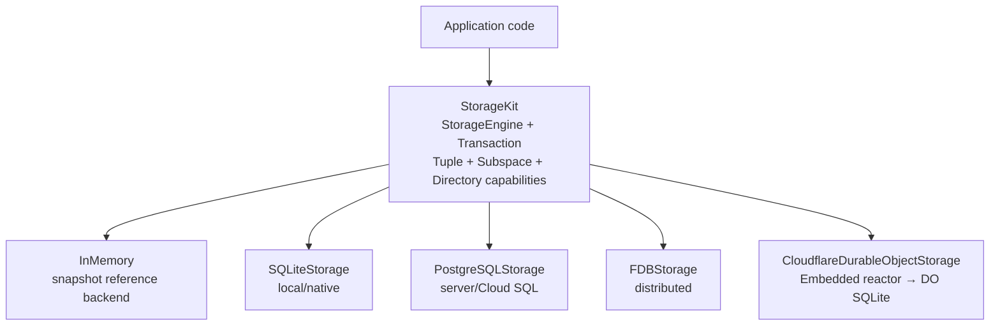

# StorageKit

A unified key-value storage abstraction for Swift, with pluggable backends for
**FoundationDB**, **SQLite**, **PostgreSQL**, **Cloudflare Durable Object
SQLite**, and **in-memory** storage.

StorageKit provides a single `Transaction` protocol that works identically across all backends. Write your data access code once, then swap the backend without changing application logic.

## Features

- **Unified API** — `StorageEngine` and `Transaction` protocols abstract away backend differences
- **FDB-compatible semantics** — Lexicographic key ordering, range scans, `KeySelector`, Tuple Layer, Subspace, and transactional Directory and Partition placement
- **Zero-copy design** — backend-native range results feed an explicitly
  cleaned-up `KeyValueCursor` without materializing intermediate row arrays
- **Swift 6.4 concurrency** — Full `Sendable` conformance, `Mutex` for synchronization, no `@unchecked Sendable`
- **Nested transactions** — SQLite backend detects nested calls via `@TaskLocal` and creates strictly ordered savepoint-backed child transactions
- **Foundation-free Cloudflare protocol** — bounded StorageKit Wire v1 values, encoding, and decoding for Native, WASM, and Embedded Swift
- **Durable Object transactions** — SQLite persistence, pinned reads, selector-aware conflicts, bounded pagination, and atomic commit

## Installation

Add to your `Package.swift`:

```swift
dependencies: [
    .package(url: "https://github.com/1amageek/database-types.git", from: "26.0730.0"),
    .package(url: "https://github.com/1amageek/storage-kit.git", from: "26.0807.0"),
]
```

Then add the targets you need:

```swift
.target(
    name: "YourApp",
    dependencies: [
        .product(name: "DatabaseTypes", package: "database-types"),
        .product(name: "StorageKit", package: "storage-kit"),
        // Add StorageKitSystemClock when the runtime supplies system clock/sleep.
        .product(name: "StorageKitSystemClock", package: "storage-kit"),
        // Add StorageKitFoundation only when Foundation Date/UUID tuple adapters are needed.
        .product(name: "StorageKitFoundation", package: "storage-kit"),
        // Pick one (or more) backends:
        .product(name: "SQLiteStorage", package: "storage-kit"),
        .product(name: "FDBStorage", package: "storage-kit"),
        .product(name: "PostgreSQLStorage", package: "storage-kit"),
        .product(name: "CloudflareDurableObjectStorage", package: "storage-kit"),
    ]
)
```

## Quick Start

```swift
import DatabaseTypes
import StorageKit
import SQLiteStorage

// Create an engine
let engine = try SQLiteStorageEngine(configuration: .inMemory)

// Write and read within a transaction
try await engine.withTransaction { tx in
    let key = ByteString(utf8: "hello")
    try tx.setValue([1, 2, 3], for: key)

    let value = try await tx.getValue(for: key)
    // value == [1, 2, 3]
}
```

### Lifecycle and ownership

Engine shutdown has two explicit phases. `requestShutdown()` synchronously
closes admission for new transactions and starts backend cleanup. `shutdown()`
requests the same transition and asynchronously waits for the authoritative
cleanup completion. Concurrent shutdown callers share one completion; cleanup is
never started twice.

```swift
let engine = try SQLiteStorageEngine(configuration: .inMemory)
defer { engine.requestShutdown() } // synchronous safety boundary

try await engine.withTransaction { transaction in
    // Transaction and cursor resources remain owned by this operation.
}
await engine.waitUntilShutdown() // use when cleanup completion matters
```

Integration tests and other asynchronous ownership scopes await
`waitUntilShutdown()` directly. `requestShutdown()` alone is reserved for
synchronous destruction boundaries; it does not prevent the next test or owner
from overlapping the previous backend's asynchronous cleanup.

Transaction creation is admitted atomically with the engine lifecycle. Once
shutdown admission closes, new transaction creation fails with a typed
`StorageError`; a transaction admitted before the transition retains the
backend resources required by its own terminal commit or cancellation contract.
FoundationDB transfers its database handle to each admitted transaction so
Directory operations can finish after the engine releases its handle. The
FoundationDB client network is process-global and is intentionally not stopped
by an individual storage engine.

Range cursors are single-consumer, zero-copy views over backend-owned buffers.
Call `finish()` when iteration stops early. `finish()` is terminal and repeated
calls reproduce the same cleanup outcome. If a cursor escapes a transaction,
the caller must retain the operation owner with
`cursor.retainingLifetime(of:)`; the shared lifetime is released only after the
cursor reaches terminal cleanup.

PostgreSQL query bindings are an explicit ownership boundary rather than a
zero-copy cursor. PostgresNIO may retain a parameter after the synchronous
`ByteString` borrow returns, so each bound key or value is copied directly once
into its final independently owned `ByteBuffer`. The binding helper and its
borrow-counting test enforce one source borrow, distinct backing addresses, and
byte-for-byte equivalence without an intermediate array.

## Backends

All backends conform to `StorageEngine` with a unified `init(configuration:)` pattern.

### InMemory

No dependencies. Sorted array with snapshot isolation. Ideal for testing.

```swift
let engine = InMemoryEngine()
```

### SQLite

File-based or in-memory. Uses a `WITHOUT ROWID` table for efficient BLOB key B-tree storage. A coordinator actor owns each transaction from `BEGIN IMMEDIATE` through commit or rollback, while short synchronous connection access is protected by `Mutex`.

`SQLiteStorage` resolves the native SQLite library through `pkg-config sqlite3`.
Linux builds therefore require SQLite development headers and a matching
library; Debian-family systems provide them through `libsqlite3-dev`.

```swift
// File-based
let engine = try SQLiteStorageEngine(configuration: .file("/path/to/db.sqlite"))

// In-memory (testing)
let engine = try SQLiteStorageEngine(configuration: .inMemory)
```

### FoundationDB

Requires a running FDB cluster. Wraps FDB's native `TransactionProtocol` while
leaving whole-transaction retry policy to the higher database layer.

```swift
let engine = try await FDBStorageEngine(configuration: .init())
```

FoundationDB client startup is serialized automatically across concurrent
storage-engine initialization. `fdb-swift-bindings` owns FoundationDB C handle
and future lifetimes, while `DatabaseTypes.ByteString` is the shared byte value
exposed to StorageKit. FoundationDB result buffers therefore reach StorageKit as
borrowed `ByteString` storage without an intermediate byte wrapper or payload
copy.

```text
DatabaseTypes.ByteString
        ↑
fdb-swift-bindings
        ↑
     FDBStorage
```

### PostgreSQL

PostgreSQL uses PostgresNIO connection pooling and `BYTEA` key/value columns.
The default isolation level is `SERIALIZABLE`; higher database layers own
whole-transaction retry. TCP, Unix-domain socket, and Cloud SQL socket
configurations use the same engine.

```swift
let configuration = PostgreSQLConfiguration(
    host: "127.0.0.1",
    username: "app",
    password: password,
    database: "app"
)
let engine = try await PostgreSQLStorageEngine(
    configuration: configuration
)
```

Each bound key or value crosses into PostgresNIO with one required copy into
its final independently owned `ByteBuffer`. Range results remain lazy and use
keyset pagination rather than materializing the full range.

The PostgreSQL release gate uses an isolated PostgreSQL 16 database and the
pinned Swift 6.4 snapshot:

```bash
TOOLCHAINS=org.swift.64202608141a \
POSTGRES_TEST_HOST=database.test \
POSTGRES_TEST_PORT=5432 \
POSTGRES_TEST_USER=postgres \
POSTGRES_TEST_PASSWORD=test \
POSTGRES_TEST_DB=storage_kit_test \
scripts/postgresql-test-harness
```

The harness enforces its reviewed exact successful integration-test count, then
repeats the same target without service variables and verifies that a missing
endpoint is an explicit failure rather than an all-skipped success. Static
Musl portability is checked separately with the command documented in
`AGENTS.md`.

### Cloudflare Durable Object SQLite

The Cloudflare backend is split by runtime boundary:

| Product | Use |
|---|---|
| `CloudflareDurableObjectStorageWire` | Foundation-free StorageKit Wire v1 values, bounded encoding, and bounded decoding |
| `CloudflareDurableObjectStorage` | `StorageEngine`, transaction state, and typed StorageKit Wire client |
| `CloudflareDurableObjectStorageHTTP` | URLSession transport for native clients |
| `CloudflareDurableObjectStorageHostTransport` | Synchronous `storage_host.dispatch/receive/discard` transport for the Embedded WASM reactor |

`StorageKit` itself is Foundation-free. `StorageKitFoundation` supplies the
explicit Foundation `Date` and `UUID` Tuple Layer adapters; canonical UUID tuple
decoding returns `DatabaseTypes.UUID`.

`StorageKit` owns the monotonic clock contract but no operating-system clock.
`StorageKitSystemClock` is the optional native adapter for runtimes that select
Swift's `ContinuousClock`. `CloudflareDurableObjectStorage` depends only on the
clock protocol and requires its composition root to inject a clock. The
Embedded reactor therefore does not inherit an operating-system clock product.

The storage engine and typed client use the canonical
`CloudflareDurableObjectStorageWire` request, response, mutation, range, and
partition identity values directly. The backend does not define parallel DTOs
for the same wire semantics.

The reusable JavaScript host lives in
`Workers/CloudflareDurableObjectStorageHost`. An application-owned Durable
Object creates this host with `ctx.storage.sql`; the host persists keys,
metadata, and conflict history in Durable Object SQLite. HTTP routing,
authorization, Worker lifecycle, and deployment remain application concerns.
The Worker under `test/fixtures` exists only for real local SQLite validation.

StorageKit Wire v1 is a bounded binary storage protocol. It is intentionally
separate from database-framework's DatabaseWire query protocol. See
`Docs/CLOUDFLARE_DURABLE_OBJECT_STORAGE_DESIGN.md` for the complete contract.

## Core Concepts

### Transaction

All reads and writes go through `Transaction`. The protocol mirrors FDB's
transaction semantics. Streaming callers retain `KeyValueCursor`; collection is
an explicit ownership boundary:

```swift
try await engine.withTransaction { tx in
    // Point read
    let value = try await tx.getValue(for: key)

    // Range scan (begin inclusive, end exclusive)
    let results = try await tx.collectRange(begin: startKey, end: endKey)

    // Write (buffered until commit)
    try tx.setValue(newValue, for: key)

    // Delete
    try tx.clear(key: key)

    // Range delete
    try tx.clearRange(beginKey: start, endKey: end)

    // Auto-committed on success, rolled back on error
}
```

`withTransaction` handles commit/rollback automatically. For manual control, use `createTransaction()`.

### KeySelector

FDB-compatible key selectors for precise range boundaries:

```swift
// First key >= target
KeySelector.firstGreaterOrEqual(key)

// First key > target
KeySelector.firstGreaterThan(key)

// Last key <= target
KeySelector.lastLessOrEqual(key)

// Last key < target
KeySelector.lastLessThan(key)
```

### Tuple Layer

Encodes multiple typed values into byte arrays where lexicographic order of the encoded bytes matches the logical order of the elements. Compatible with the FDB Tuple Layer specification.

```swift
let tuple = Tuple("users", Int64(42), "profile")
let packed: ByteString = tuple.pack()
let unpacked = try Tuple.unpack(from: packed)
```

Supported types: `String`, signed and unsigned integers, `Float`, `Double`,
`Bool`, `ByteString`, `DatabaseTypes.UUID`, nested `Tuple`, `TupleNil`, and
`Versionstamp`. Foundation `Date` and `UUID` adapters are provided by
`StorageKitFoundation`.

### Subspace

Manages key prefixes for logical partitioning:

```swift
let users = Subspace("users")
let user42 = users.subspace(Int64(42))

// Pack a key within the subspace
let key = user42.pack(Tuple("email"))

// Get the full range of keys in a subspace
let (begin, end) = users.range()

// Check membership
users.contains(key) // true
```

### Directories, Partitions, and leases

Every engine exposes exactly one `DirectoryAccess` catalog through
`engine.directoryAccess`. That catalog is the sole existence authority for
Directories and Partitions of its backend: FoundationDB realizes it on the
native Directory Layer, SQLite, PostgreSQL, and Cloudflare Durable Object
realize it as catalog rows in the same store as the data, and the in-memory
engine keeps it in memory. Every catalog operation receives the caller-owned
transaction, so Directory metadata and application writes commit together.

```swift
try await engine.withTransaction { transaction in
    let catalog = engine.directoryAccess
    let root = try await catalog.openOrInitializeRoot(transaction: transaction)
    let app = try await catalog.openOrCreateDirectory("app", in: root, transaction: transaction)
    let tenant = try await catalog.openOrCreatePartition(
        "tenant-1",
        in: app,
        transaction: transaction
    )

    // A lease is a noncopyable owner bound to one Partition and one transaction.
    let lease = try await engine.leasePartition(tenant, transaction: transaction)
    try await lease.withWriteAccess(transaction) { access in
        let key = tenant.root.root.pack(Tuple("answer"))
        try access.setValue([0x2A], for: key)
    }
    lease.release()
}
```

- A node is named by one path component and carries a `LayerTag`. The empty tag
  is a plain Directory and the tag `partition` is a Partition, matching the
  FoundationDB Directory Layer, so `open` and `openOrCreate` take the tag rather
  than a separate operation per kind. `openDirectory`, `openPartition`,
  `openOrCreateDirectory`, and `openOrCreatePartition` are the tag-restricted
  spellings of those two operations.
- Read operations (`openRoot`, `open`, `listChildren`) accept
  `TransactionReadAccess` and never create; absence is reported as `nil`, never
  as an empty Directory. `listChildren` returns `DirectoryEntry` values that
  carry each child's name and layer, so one page describes Directories and
  Partitions together.
- Write operations (`openOrInitializeRoot`, `openOrCreate`, `move`, `remove`)
  require `TransactionAccess` and are atomic with the transaction that carries
  them. `move` relocates a whole node, Partitions included, within one Directory
  Layer, and `remove` deletes a child with its entire subtree.
- `engine.leasePartition(_:transaction:)` resolves the Partition through the
  catalog inside the caller's transaction and binds key bounds to the Partition
  root.
- `PartitionLease.withReadAccess` / `withWriteAccess` expose bounded access
  objects; a key outside the Partition fails with a typed error before any
  backend call.
- A lease is not an exclusion: `move` and `remove` stay admitted while one is
  held, because admitting a destructive operation is a decision above this
  layer. What a lease guarantees is that stale work fails instead of being
  redirected. Issuance and every binding re-resolve the Partition in the
  caller's transaction, so an address that is absent, no longer a Partition, or
  carrying a different keyspace prefix fails with `staleLease`. Prefixes are
  never reused, so the guarantee holds across engine instances and processes
  reading the same store.
- Tuple encoding is frozen as Tuple V1 by `TupleV1GoldenVectorTests`; Directory
  root prefixes are Tuple-encoded integers allocated by the catalog.

### Physical Compaction

Physical storage maintenance is an optional transaction capability. Native
`SQLiteStorage` exposes `StorageCompactionTransaction`; Cloudflare
Durable Object SQLite does not, because the public platform does not expose the
required vacuum PRAGMAs. Capability absence is reported as unsupported and is
never treated as a successful no-op.

## Architecture



### Key Internal Types

| Type | Module | Purpose |
|------|--------|---------|
| `SortedKeyValueStore` | StorageKit | O(log n) sorted array with binary search, used by InMemory backend |
| `KeyValueRangeResult` | StorageKit | Array-backed reference result for the in-memory backend |
| `SQLiteRangeResult` | SQLiteStorage | Lazy cursor-backed result with explicit finish and ownership handling |
| `compareBytes` | StorageKit | `memcmp`-based lexicographic byte comparison (hot path) |
| `ActiveTransactionContext` | StorageKit | `@TaskLocal` transaction ownership used by SQL adapters and common execution |

## Requirements

- Swift 6.4+
- macOS 15+ / iOS 18+
- FoundationDB 7.1+ (for FDBStorage only)

## License

Licensed under the [MIT License](LICENSE).
