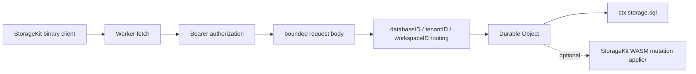

# Cloudflare Durable Object Storage Host

This Worker exposes the `StorageKit` binary storage protocol on top of Durable
Object SQLite.



## Runtime Boundary

Swift WASM is the storage-compatible execution kernel. JavaScript remains the
Cloudflare host layer because Workers and Durable Objects expose `fetch`,
bindings, secrets, request streams, and `ctx.storage.sql` through the JavaScript
runtime. Keep this layer thin: it should route requests, enforce limits,
authorize callers, and bridge to Durable Object SQLite.

## Scope Routing

Requests are decoded before routing and are assigned to one Durable Object by
the request scope.

| Scope field | Purpose |
|---|---|
| `databaseID` | Logical database |
| `tenantID` | Tenant partition |
| `workspaceID` | Workspace partition |

The Durable Object name is deterministic for the same scope, so all writes for
one logical database partition are serialized by the same Durable Object.

## Authorization And Limits

Every public Worker request must include:

| Requirement | Value |
|---|---|
| Method | `POST` |
| Authorization | `Bearer <STORAGEKIT_ACCESS_TOKEN>` |
| Content-Type | `application/octet-stream` |

`STORAGEKIT_ACCESS_TOKEN` is a secret and must be configured before production
deploy:

```bash
wrangler secret put STORAGEKIT_ACCESS_TOKEN
```

`STORAGEKIT_MAX_REQUEST_BYTES` controls the maximum accepted binary request
size. The default configured value is `4194304`.

## Storage Semantics

| Area | Behavior |
|---|---|
| Transaction version | Stored in Durable Object SQLite metadata |
| Read conflicts | Checked against retained write conflict ranges |
| Range conflicts | Include selector gaps, not only returned rows |
| Conflict retention | Old conflict rows are pruned after a bounded version window |
| Request body | Read through a bounded stream reader |

## Commands

```bash
npm install
npm test
npm run smoke:e2e
npm run smoke:local:persistence
npm run deploy:dry-run
npm run deploy
```

Remote smoke tests require the deployed Worker URL and access token:

```bash
STORAGEKIT_REMOTE_URL="https://example.workers.dev" \
STORAGEKIT_ACCESS_TOKEN="..." \
npm run smoke:remote
```

Persistence smoke tests use the same remote configuration:

```bash
STORAGEKIT_REMOTE_URL="https://example.workers.dev" \
STORAGEKIT_ACCESS_TOKEN="..." \
npm run smoke:remote:persistence
```
