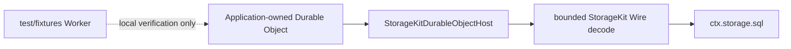

# Cloudflare Durable Object SQLite Host

This package exports the reusable JavaScript host that executes
`StorageKit Wire v1` against Durable Object SQLite. It does not own a public
Worker, authentication policy, or application routing.


```mermaid
flowchart LR
  ApplicationDO["Application-owned Durable Object"] --> Host["StorageKitDurableObjectHost"]
  Host --> Wire["bounded StorageKit Wire decode"]
  Wire --> SQLite["ctx.storage.sql"]

  Fixture["test/fixtures Worker"] -. "local verification only" .-> ApplicationDO
```

## Runtime Boundary

The full database runtime consumes this storage host through StorageKit Wire.
The application owns its Worker routes, authorization boundary, Durable Object
binding, and lifecycle. This package owns bounded storage-wire dispatch and
Durable Object SQLite operations. Database semantics remain in the Swift
runtime.

## Partition Identity Routing

The public `nameForPartitionIdentity` export deterministically maps a partition
identity to a Durable Object name. An application-owned router may use this operation when it chooses
to expose StorageKit Wire over HTTP.

| Partition identity field | Purpose |
|---|---|
| `databaseID` | Logical database |
| `tenantID` | Tenant partition |
| `workspaceID` | Workspace partition |

The Durable Object name is deterministic for the same partition identity, so all writes for
one logical database partition are serialized by the same Durable Object.

## Test Fixture

`test/fixtures` contains a private Worker used by unit and local Wrangler smoke
tests. Its HTTP contract is:

| Requirement | Value |
|---|---|
| Method | `POST` |
| Authorization | `Bearer <STORAGEKIT_ACCESS_TOKEN>` |
| Content-Type | `application/octet-stream` |

The fixture uses `STORAGEKIT_ACCESS_TOKEN` and
`STORAGEKIT_MAX_REQUEST_BYTES`. These variables and the fixture's bearer-token
policy are test concerns, not exported production API.

## Storage Semantics

| Area | Behavior |
|---|---|
| Transaction version | Stored in Durable Object SQLite metadata |
| Read conflicts | Checked against retained write conflict ranges |
| Range conflicts | Include selector gaps, not only returned rows |
| Conflict retention | Old conflict rows are pruned after a bounded version window |
| Request body | Read through a bounded stream reader |

## Commands

```bash
npm install
npm test
npm run smoke:local
npm run smoke:local:persistence
npm run fixture:validate
```

The local smoke run exercises the real Wrangler Durable Object SQLite runtime,
round-trips the exact 2,000,000-byte combined key-and-value boundary, stops the
runtime, and requires the endpoint to become unreachable before succeeding.

`wrangler.jsonc` points to the fixture solely so the tests exercise real local
Durable Object SQLite. Production deployment configuration belongs to the
application that imports this host.
